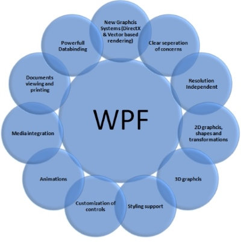

# WPF

> Windows Presentation Foundation (kurz WPF), auch bekannt unter dem Codenamen Avalon, ist ein Grafik-Framework und Fenstersystem des .NET Frameworks von Microsoft. Die WPF dient der Gestaltung von grafischen Benutzeroberflächen und der Integration von Multimedia-Komponenten und Animationen. Sie vereint DirectX, Windows Forms, Adobe Flash, HTML und CSS.

[Wikipedia](https://de.wikipedia.org/wiki/Windows_Presentation_Foundation)

## Systemvoraussetzungen 

### .NET Framework

Mit den im Jahre 2006 unter .NET 3.0 eingeführten Programmiermodellen WPF, WCF und WF stellte Microsoft erstmals grössere, in Managed Code implementierte Bibliotheken zur Verfügung. Die WPF ist seither die strategische Plattform für die Entwicklung von Benutzeroberflächen unter Windows. 

| Jahr | .NET Framework | Visual Studio                       | WPF          | C#   |
| ---- | -------------- | ----------------------------------- | ------------ | ---- |
| 2002 | .NET 1.0       | VS.NET                              |   -          | v1.0 |
| 2003 | .NET 1.1       | VS 2003                             |   -          | v1.1 |
| 2005 | .NET 2.0       | VS 2005                             |   -          | v2.0 |
| 2006 | .NET 3.0       | VS 2005 + Extensions (WPF, WCF ...) | v3.0         | v2.0 |
| 2007 | .NET 3.5       | VS 2008                             | v3.5         | v3.0 |
| 2010 | .NET 4.0       | VS 2010                             | v4.0         | v4.0 |
| 2012 | .NET 4.5       | VS 2012                             | v4.5         | v5.0 |
| 2015 | .NET 4.6       | VS 2015                             | v4.6         | v6.0 |
| 2017 | .NET 4.7       | VS 2017                             | v4.7         | v7.0 |

Wie die Tabelle zeigt, wird die WPF mit der Version des .NET Frameworks bezeichnet. Bei der ersten, mit dem .NET Framework 3.0 eingeführten Version wird also tatsächlich nicht von WPF 1.0 sondern von WPF 3.0 gesprochen. 

## Stärken und Eigenschaften der WPF

Anwender erwarten von einem modernen GUI:  

* Schicke 2D- und 3D-Grafiken
* Transparenz 
* Animationen  
* Hardwareunterstützung
* Medien (Videos, Sound)

Und Programmierer haben folgende Wünsche:  

* Trennung von Design und Logik/Daten 
* einfache Aufgabenteilung zwischen Designer und Programmierer 
* Durchgängiges, nachvollziehbares DataBinding 
* Vorlagenbasierte Darstellungen, Austauschbarkeit des Designs

Mit der WPF gehen die Wünsche in Erfüllung. 

### 2D- und 3D-Grafiken 

3D-Grafiken können in der WPF auf dieselbe Weise gezeichnet und animiert werden, wie 2D-Grafiken. Dazu werden viele Zeichnungswerkzeuge bereit gestellt, wie z.B. die verschiedenen Brushes. 

### Animationen 

Mit der WPF wird die Erstellung von Animationen wesentlich einfacher, da es einen integrierten Mechanismus dafür gibt. Die Verwendung eines Timers und eines dazugehörigen Event Handlers entfällt.  

### Audio/Video 

Audio- und Video-Elemente lassen sich einfach in eine WPF-Applikation einbinden. Dafür stehen verschiedene Klassen zur Verfügung. 

### Vektorbasierte Darstellung 

Die in nativem Code geschriebene Komponente _milcore.dll_ kapselt DirectX und ist zuständig für die Darstellung von 3D, 2D, Text, Video, Bilder und Animationen. Ein entscheidender Vorteil, der mit MilCore erreicht wird, ist die vektorbasierte Darstellung. Dadurch können WPF-Anwendungen beliebig skaliert werden, ohne an «Schärfe» zu verlieren. 

### Hardwareunterstützung  

Die WPF greift für das Zeichnen des Fensterinhalts (Rendering) auf DirectX zurück. Dadurch lassen sich die Möglichkeiten der in heutigen Computern verbauten Grafikkarten mit 3D-Beschleunigung voll ausnutzen. Sind Hardware und Treiber entsprechend eingerichtet, kann mit WPF eine sehr gute Performance erreicht werden.  

### Flexibles Inhaltsmodell  

In den bisherigen Programmiermodellen wie Windows Forms, konnte bspw. ein Button nur Text oder ein Bild enthalten. Mit dem flexiblen Inhaltsmodell der WPF hingegen kann ein Button - genau wie die meisten anderen visuellen Elemente - einen beliebigen Inhalt haben. Das bedeutet, dass Controls beliebig ineinander verschachtelt werden können. Damit sind wir in der Lage, beliebig komplexe Controls aufzubauen.

### Layout 

Die WPF stellt einige Layout-Panels zur Verfügung, um Controls dynamisch anzuordnen und zu positionieren. Dank des flexiblen Inhaltsmodells lassen sich diese Panels beliebig ineinander verschachteln, wodurch sehr komplexe Layouts möglich werden. 

### Styles und Templates 

Ein Style ist eine Sammlung von Eigenschaftswerten, die sich einem oder mehreren Elementen der Benutzeroberfläche zuweisen lässt. Damit kann ein einheitliches Design geschaffen werden ohne den gleichen Code an mehrere Stellen zu kopieren. 

Ein Style wird oft verwendet, um die `Template`-Property eines Controls zu setzen. Mit Templates lässt sich das Aussehen eines Controls neu und damit total anders definieren. 

### DataBinding 

GUI-Elemente können mit DataBinding an verschiedene Datenquellen gebunden werden. Dadurch entfällt die Programmierung von Event-Handlern, welche die Benutzeroberfläche oder die Datenquelle bei einer Änderung aktualisieren. 

### Text & Dokumente 

Die WPF stellt eine umfangreiche API zum Umgang mit Text und Dokumenten bereit. Es werden fixe und fliessende Dokumente unterstützt. Fixe Dokumente unterstützen eine gleichbleibende, fixierte Darstellung (ähnlich wie PDF), während fliessende Dokumente sich an verschiedene Faktoren anpassen wie z.B. die Grösse des Fensters. 

### Trennung von Design und Code

 Mit WPF verwendeten Sprache *XAML* erhalten wir eine saubere Trennung von Design und Code. XAML ist eine XML-basierte Sprache, die bei WPF dazu verwendet wird, grafische Elemente, Animationen, Transformationen, Darstellung von Farbverläufen,  Abspielen von Mediadateien und vieles mehr deklarativ zu programmieren.
 
 XAML ermöglicht folgendes Szenario: 
 
 > Der Grafiker gestaltet mit Designertools (z.B. Blend) die Benutzerschnittstelle und generiert XAML-Code. Der Entwickler bekommt diesen XAML-Code und entwickelt in einer Programmiersprache seiner Wahl (i.d.R. C#) die Programmlogik dazu. Das heisst, XAML-Objekte, die vom Designer angelegt wurden, werden vom Entwickler mit programmlogischer Funktionalität versehen. Auf diese Weise können beide, Designer und Entwickler, praktisch gleichzeitig am selben Projekt arbeiten. 

 
