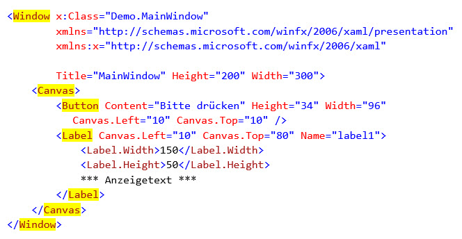
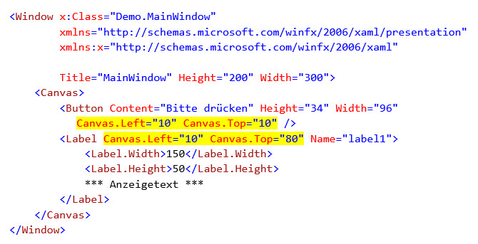
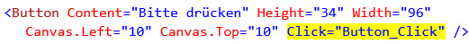

# XAML

>  Extensible Application Markup Language (XAML, ausgesprochen [ˈzæ:mɛl]) ist eine von Microsoft entwickelte Beschreibungssprache zur Gestaltung grafischer Benutzeroberflächen. 

[Wikipedia](https://de.wikipedia.org/wiki/Extensible_Application_Markup_Language)

Genau wie die Sprache HTML der visuellen Darstellung von Webseiten zugrunde liegt, liegt die Sprache XAML der visuellen Darstellung von WPF-Anwendungen zugrunde.

## XAML-Syntax

Bei XAML handelt es sich um eine XML-Struktur, deren Elemente bestimmte Namen haben, z.B. Window, Canvas, Button, Label. 



Die Namen der XAML-Elemente fallen nicht vom Himmel. Es sind vielmehr Typ-Namen aus dem .NET Framework. Mit deren Definition in XAML "veranlassen" wir die Instaziierung der entsprechenden Datentypen zur Laufzeit. Im obigen Beispiel bekommen wir zur Laufzeit eine Instanz von `Window`, eine Instanz von `Canvas`, eine Instanz von `Button` und eine Instanz von `Label`. 

## Content Controls 

Content Controls spielen eine wichtige Rolle bei der Gestaltung von Benutzeroberflächen mit WPF. Jedes Content Control kann genau ein einziges Child-Element besitzen, welches in der Regel ein Layout-Container ist. Ein Beispiel für ein Content-Control ist die Klasse `Window`. 

## Layout Container 

Es gibt in der WPF diverse Layout Container, z.B. das `Canvas`, das `Grid` oder das `StackPanel`. In einem Layout Container können beliebig viele andere Elemente platziert werden, z.B. Buttons, Ellipsen, TextBlöcke aber auch weitere Layout-Container. 

Da Controls bei der WPF beliebig ineinander verschachtelt werden können, sind wir mit Layout-Containern in der Lage, beliebig komplexe Layouts aufzubauen. Achte aber darauf, dass dein GUI am Ende für den Benutzer noch bedienbar ist; denn nicht alles, was möglich ist, macht auch Sinn...

## Eigenschaften setzen

Wer Objekte deklariert, möchte auch deren Eigenschaften setzen. Eine Eigenschaft kann in XAML auf drei unterschiedliche Arten gesetzt werden: 

1. Als Attribut: 
```xml 
    <Button Content="Hallo Welt" />
```

2. Als Child-Element:  
```xml
<Button>
    <Button.Content>Hallo Welt</Button.Content>
</Button> 
```

3. Als inneres Element (*nur für Standard-Eigenschaften möglich*): 
```xml
<!-- Standard-Eigenschaft von Button ist «Content» -->
<Button>
    Hallo Welt 
</Button>
```

### Standard-Eigenschaft _Content_ von Content Controls

Die Standard-Eigenschaft von Content-Controls ist _Content_.  Diese Eigenschaft ist vom Typ `Object`. Das heisst, dieser Eigenschaft kann ein beliebiges Element zugewiesen werden.


### Standard-Eigenschaft _Children_ von Layout Containern

Die Standard-Eigenschaft von Layout-Containern ist _Children_. Bei dieser handelt es sich um eine `UIElementCollection` von den Komponenten, die sich im Container befinden. Das heisst dieser Eigenschaft können mehrere Elemente zugewiesen werden. Beim `Canvas`-Element im untenstehenden Beispiel  wurden als inneres Element zwei Elemente definiert, nämlich ein `Button` und ein `Label`. Diese beiden Elemente werden automatisch zur Laufzeit der Standard-Eigenschaft _Children_ des Canvas-Elementes zugewiesen. 

```xml
<Canvas> 
    <Button Content="Bitte drücken" Height="34" Width="96" 
        Canvas.Left="12" Canvas.Top="12" />
    <Label Canvas.Left="16" Canvas.Top="82" Name="label1">
        <Label.Width>150</Label.Width>
        <Label.Height>50</Label.Height>
        *** Anzeigetext *** 
    </label>
</Canvas>
```

## Attached Dependency Properties

Die sogenannten _Attached Dependency Properties_ sind Eigenschaften, die ein Control nicht selbst besitzt, sondern die in einer externen Klasse definiert sind. Im folgenden Beispiel ist es die Klasse `Canvas`, welche die Attached Dependency Properties _Left_ und _Top_ bereit stellt.  



Jedes Framework-Element innerhalb des XAML-Codes kann diese Attached Dependency Properties setzen. Das Canvas-Element wird seine Kind-Elemente, in unserem Fall den Button und das Label, nach diesen Properties fragen und den gesetzten Wert dazu benutzen, die Elemente zu positionieren.

## Ereignisse (Events) 

Events werden von Klassen verwendet um Informationen über Aktionen an andere Klassen respektive Objekte zu übermitteln. Das Objekt, welches das Ereignis sendet (oder auslöst), wird als _Herausgeber_ bezeichnet. Die Objekte, die das Ereignis empfangen und behandeln, werden als _Abonnenten_ bezeichnet.

Ereignisse werden in der Regel verwendet, um Benutzeraktionen wie Mausklicks oder Menüauswahlen in GUI-Schnittstellen zu signalisieren.


Das folgende Beispiel zeigt einen Button mit einem Attribut, das einen Event-Handler bindet. Das Attribut heisst gleich wie das Event (Click) und der Attributwert ist der Name einer Methode, die im Code-Behind innerhalb der _Window_-Klasse definiert werden muss.



 Die in der Code-Behind-Datei mit C# implementierte Methode wird zur Laufzeit aufgerufen, immer wenn der Benutzer den betreffenden Button anklickt.