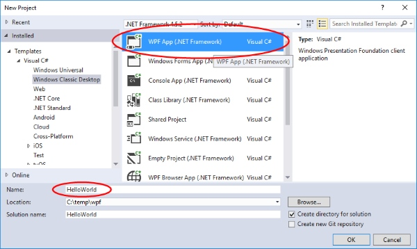

# Hello World mit WPF und XAML

## Aufgabe 

Starte [Visual Studio](https://www.visualstudio.com/de/), erstelle ein neues C#-Projekt vom Typ "WPF App" (_File_ > _New_ > _Project_) und nenne das Projekt "HelloWorld". 



Ersetze im XAML-Code das `<Grid>`-Element mit einem `<Canvas>`-Element und füge dem `<Canvas>` Layout-Container ein Child-Element `<Button>` hinzu, der unter anderem ein Attribut hat, das den _Click_-Event des Buttons an die Methode _Button_Click_ bindet,  sodass sich folgender XAML-Code ergibt: 

```xml
<Window x:Class="HelloWorld.MainWindow"
    xmlns="http://schemas.microsoft.com/winfx/2006/xaml/presentation"
    xmlns:x="http://schemas.microsoft.com/winfx/2006/xaml"

    Title="MainWindow" Height="200" Width="300">
<Canvas>
        <Button Content="Klick mich" Canvas.Top="20"
                Canvas.Left="20" Click="Button_Click"/>
    </Canvas>
</Window>
```

Markiere im XAML-Code den Attributwert "Button_Click" mit der rechten Maustaste und aktiviere im Kontext-Menu den Befehl _Go To Definition_. Im Code-Behind kannst du nun den Event-Handler ausprogrammieren. Gib folgenden C#-Code ein. 
 
```CSharp
private void Button_Click(object sender, RoutedEventArgs e)
{
    MessageBox.Show("Hello World!");
}
```

Starte die Applikation mit der Taste {F5}.