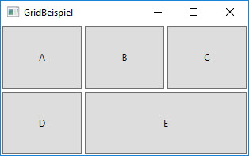

# Layout Container

Bei der Erstellung von grafischen Benutzeroberflächen (GUI) dreht sich am Anfang alles um das Layout, also darum, wie die Oberfläche strukturiert werden soll.   

WPF stellt grundsätzlich zwei Arten von Framework-Elementen bereit, mit denen Layouts erstellt werden können.

* Layout Container
* Content Controls 

Layout Container respektive `Panel`-Elemente sind Komponenten, die das Rendern von Elementen steuern, d. h. ihre Grösse und Abmessungen, ihre Position und die Anordnung des untergeordneten Inhalts. 

Content Controls wie z.B. `Window` können einen beliebigen Inhalt haben, aber nur genau ein Unterelement. Werden für ein Layout mehrere Unterelemente benötigt - was praktisch immer der Fall ist - werden Layout Container eingesetzt. 

## WPF-Klassenhierarchie 

Die wichtigste Basisklasse ist die Klasse `DependencyObject`. In dieser Klasse ist ein Grossteil der Infrastruktur der WPF implementiert. 

Weiter unten in der Vererbungshierarchie finden sich zwei Klassen, die für die Darstellung wichtig sind: `UIElement` und `FrameworkElement`. Davon sind die meisten Controls abgeleitet (`Window`, `Button` usw.) 

Die Layout Container sind abgeleitet von der abstrakten Basis-Klasse namens `Panel`. 


## Panels

WPF bietet eine Anzahl vordefinierter Panel-Elemente.   
* StackPanel
* WrapPanel
* DockPanel
* Grid
* UniformGrid
* Canvas  

Nachfolgend werden die Panel-Elemente StackPanel, WrapPanel, DockPanel und Grid vorgestellt. 

### StackPanel

Das `StackPanel` ordnet die einzelnen Elemente, die es umfasst, der Reihe nach an, ohne dass wir uns selbst um die Positionierung kümmern müssen. Als Eigenschaft kann beim StackPanel die Eigenschaft _Orientation_ gesetzt werden, die bestimmt, ob die Elemente horizontal oder vertikal angeordnet werden. 


```xml
<Window ... >
    <StackPanel Orientation="Horizontal">
        <Ellipse Width="50" Height="30" Fill="blue" />
        <Ellipse Width="50" Height="30" Fill="red" />
        <Ellipse Width="50" Height="30" Fill="green" />
    </StackPanel>
```

### WrapPanel 

Das `WrapPanel` verhält sich ähnlich wie Word oder ein Browser mit HTML. Solange horizontal genügend Platz ist, werden die Elemente nebeneinander angeordnet. Reicht der Platz nicht aus, erfolgt ein Umbruch.  


```xml
<Window ... >
    <WrapPanel>
        <Image Source="pingu.jpg" Margin="5" Height="75"/>
        <Image Source="pingu.jpg" Margin="5" Height="75"/>
        <Image Source="pingu.jpg" Margin="5" Height="75"/>
        <Image Source="pingu.jpg" Margin="5" Height="75"/>
        <Image Source="pingu.jpg" Margin="5" Height="75"/>
        <Image Source="pingu.jpg" Margin="5" Height="75"/>
        <Image Source="pingu.jpg" Margin="5" Height="75"/>
    </WrapPanel>
</Window>
```
**Tipp:** Falls du das WrapPanel verwendest, solltest du darauf achten, das alle Elemente gleich gross sind; ansonsten wird das Layout bei Umbrüchen sehr schnell sehr merkwürdig aussehen.

### DockPanel

Das `DockPanel` dockt alle Elemente an einer Seite an. Die Standardseite ist links. Über die Attached Dependecy Property _DockPanel.Dock_ kann jedoch definiert werden, wo das Element sich andockt. 

Mit der Eigenschaft _LastChildFill_ kann das Verhalten des letzten Elementes eingestellt werden. Der Standard-Wert ist _true_ und bewirkt, dass das letzte Element den gesamten noch verfügbaren Platz einnimmt (in unserem Beispiel ist das der Button «E»).


```xml
 <Window ... >   
    <DockPanel LastChildFill="true">
        <Button Content="A" DockPanel.Dock="Top"/>
        <Button Content="B" DockPanel.Dock="Bottom" />
        <Button Content="C" DockPanel.Dock="Left" />
        <Button Content="D" DockPanel.Dock="Right" />
        <Button Content="E" />
    </DockPanel>
</Window>
``` 

### Grid

Das `Grid` ist eine Art Tabelle. Es ist das beliebteste Layout Panel, weil damit komplexe Layouts umgesetzt werden können. 

Mit _Grid.ColumnDefinitions_ und _Grid.RowDefinitions_ werden die Anzahl Spalten respektive die Anzahl Zeilen festgelegt. 

Die Zuweisung der Elemente zu den einzelnen Grid-Zellen erfolgt auf dem jeweiligen Element selbst, und zwar durch Zuweisung der Spalte und der Zeile an die Attached Dependency Properties  _Grid.Column_ und _Grid.Row_. 

Im folgenden Beispiel kannst du ausserdem sehen, wie sich ein Element mittels _Grid.ColumnSpan_ über zwei oder mehrere Spalten erstrecken lässt.



```xml
<Window ... >
    <Grid>
        <!-- unser Grid hat 3 Spalten... -->
        <Grid.ColumnDefinitions>
            <ColumnDefinition />
            <ColumnDefinition />
            <ColumnDefinition />
        </Grid.ColumnDefinitions>
        <!-- ...und 2 Zeilen -->
        <Grid.RowDefinitions>
            <RowDefinition />
            <RowDefinition />
        </Grid.RowDefinitions> 
        <Button Content="A" Grid.Column="0" Grid.Row="0" Margin="2" />
        <Button Content="B" Grid.Column="1" Grid.Row="0" Margin="2" />
        <Button Content="C" Grid.Column="2" Grid.Row="0" Margin="2" />
        <Button Content="D" Grid.Column="0" Grid.Row="1" Margin="2" />
        <Button Content="E" Grid.Column="1" Grid.Row="1" Grid.ColumnSpan="2" Margin="2" />
    </Grid>
</Window>
```

#### Spaltenbreite und Zeilenhöhe festlegen

Die Breite der Spalten kann mit der Eigenschaft _Width_ der Klasse `ColumnDefinition` definiert werden. Dabei sind für _Width_ sowohl absolute als auch relative Werte möglich. Relative Werte können mit dem  `*` definiert werden. 

Im folgenden Beispiel nimmt die 1. Spalte 4/7 der Gesamtbreite ein, die 2. Spalte 1/7 und die 3. Spalte nimmt 2/7 der Gesamtbreite ein. 


```xml 
<Grid.ColumnDefinitions>
    <ColumnDefinition Width="4*" />
    <ColumnDefinition Width="1*"/>
    <ColumnDefinition Width="2*"/>
</Grid.ColumnDefinitions>
```

Die Höhe der Zeilen wird analog der Spaltenbreite über die Eigenschaft _Height_ der Klasse `RowDefinition` festgelegt. Der Standardwert ist `1*`.

```xml
<Grid.RowDefinitions>
    <RowDefinition Height="1*" />
    <RowDefinition Height="3*" />
</Grid.RowDefinitions> 
```

## Anmerkungen zu Layout und Design

### Positionierung 

Absolute Positionierung im Speziellen und absolute Grössenangaben im Allgemeinen sollten vermieden werden, weil damit kein flexibles Layout möglich ist. Heutzutage gibt es viele verschiedene Geräte mit unterschiedlichen Bildschirmgrössen, z.B. PCs, Tablets oder Smartphones. Deshalb sollten wir ausschliesslich  dynamische Layouts erstellen.

<!-- >
### Bildschirmauflösung 

WPF geht von einer Bildschirmauflösung von 1/96 Zoll aus (entspricht 96 dpi). Wenn der Bildschirm eine andere Auflösung meldet, dann wird die Grösse oder die Position entsprechend umgerechnet. Hat der Bildschirm eine höhere Auflösung, stehen insgesamt mehr Hardwarepixel zur Verfügung, um wieder auf dieselbe Grösse zu kommen. 
-->