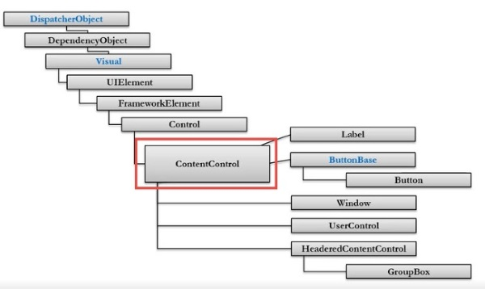
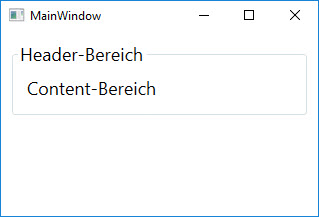
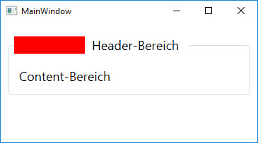

# Content Controls

Einige Content Controls hast du bereits kennen gelernt, z.B.

* `Window` 
* `Label`
* `Button`
* `UserControl`
* `HeaderedContentControl` (z.B. `GroupBox`)

Auch ein `Label` ist bei WPF ein Content Control. Du kannst einem Label also nicht nur Text, sondern beliebige Inhalte zuordnen. 

## Verschachtelung von Controls

Ein Content Control wie z.B. `Window` kann zwar einen beliebigen Inhalt haben jedoch nur genau ein Unterelement. Werden für ein Layout mehrere Unterelemente benötigt, muss dem Content Control ein [Layout Container](../03%20Layout%20Container/README.md) zugewiesen werden, der wiederum Content Controls und auch weitere Layout Container beinhalten kann. 

## WPF-Klassenhierarchie

Die für die Darstellung wichtigen Klassen sind `UIElement` und `FrameworkElement`. Davon sind u.a. auch die Content Controls abgeleitet.



## Content-Eigenschaft 

Jedes Content Control hat eine Eigenschaft _Content_, die vom Typ `Object` ist und der beliebige Objekte zugewiesen werden können. Sie repräsentiert das Kindelement des Content-Controls. Wie das zugewiesene Kindelement gerendert und angezeigt wird, hängt davon ab, von welchem Typ das Kindelement ist: 

* Kindelemente, die von `UIElement` abgeleitet sind: 
    * Darstellung durch _UIElement.OnRender()_ 
* Kindelemente, die nicht von `UIElement` abgeleitet sind: 
    * Aufruf von _ToString()_ um den den Text zu lesen 

## HeaderedContentControl

Ein `HeaderedContentControl` ist ein Content Control, dass einen Content-Bereich hat und zusätzlich noch einen Titel-Bereich. Ein solches ist zum Beispiel die `GroupBox`. 



```xml 
<StackPanel>
    <GroupBox Header="Header-Bereich" Margin="10" Padding="10">
        Content-Bereich
    </GroupBox>
</StackPanel>
```

Wie die Content-Eigenschaft ist auch die Header-Eigenschaft vom Typ `Object`. Das heisst, wir können dem Header-Bereich ein beliebiges Element zuordnen. 

Im folgenden Beispiel wurde im Header-Bereich ein Layout Container (ein `StackPanel`) platziert und darin wiederum ein rot ausgefülltes `Rectangle` sowie ein `TextBlock`.

```xml 
<StackPanel>
    <GroupBox Margin="10" Padding="10">
        <GroupBox.Header>
            <StackPanel Orientation="Horizontal">
                <Rectangle Width="100" Height="25" Fill="Red" />
                <TextBlock Text="Header-Bereich" Margin="10"/>
            </StackPanel>
        </GroupBox.Header>
        Content-Bereich
    </GroupBox>
</StackPanel>
```

Es ergibt sich folgendes Layout: 



## Templates 

Content Controls haben per se kein eigenes Aussehen, sondern das Aussehen ergibt sich immer über ein Template. 

### Standardtemplates

WPF bringt für jedes Control ein Standardtemplate mit. Diese Standardtemplates sind unterschiedlich für die verschiedenen Betriebssysteme. Deshalb sieht eine WPF-Anwendung unter Windows 7 anders aus, als unter Windows 10

### Austauschbarkeit

Die Idee hinter den Templates ist, dass diese jederzeit ausgetauscht werden können, damit Design und Layout der Anwendung einfach angepasst werden können, ohne die Funktionalität zu beeinflussen. Deshalb haben bspw. mit WPF die UserControls an Bedeutung verloren, weil bei einem UserControl die Darstellung fest mit dem Control verdrahtet ist und sich damit nicht einfach verändern lässt. 

<!-- Todo: ControlTemplates genauer erklären und Beispiel machen.  Oder verlinken auf Dokument wo ControlTemplates erklärt werden (dieses Dok müsste allerdings auch noch erstellt werden.) -->

