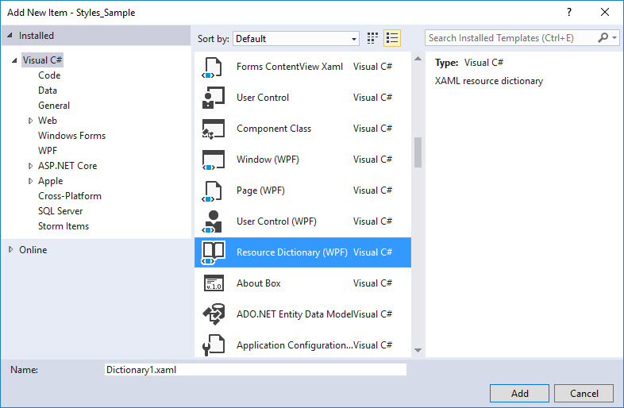

# Eine Frage des Stils

Layout und Aussehen einer WPF-Benutzeroberfläche lassen sich im XAML-Code nahezu beliebig konfigurieren. Das Einstellen der Eigenschaften für Font, Farbe, Grösse usw. kann allerdings mit beträchtlichem Aufwand verbunden sein und spätestens dann, wenn mehrere Steuerelemente einheitlich gestaltet werden sollen, entsteht schnell sehr viel redundanter XAML-Code.

Es empfiehlt sich darum mit Styles zu arbeiten. Styles werden einmal erstellt und dann  zentral zur Verfügung gestellt, um dann auf XAML-Elemente angewendet zu werden. Das Prinzip ist ähnlich wie jenes von CSS (Cascading Style Sheets) und HTML. 

## Style-Angaben in XAML 

Styles werden unterhalb des _Resources_-Tag angegeben. _Resources_ ist eine Eigenschaft von `Window`.

Jeder Style benötigt ein _Key_- sowie ein _TargetType_-Attribut. 

* Der _Key_ wird benötigt, damit der Stil verwendet werden kann. 
* Der _TargetType_ definiert, auf welche Art von Steuerelement der Stil anwendbar ist.

Über die _&lt;Setter&gt;_ Elemente werden die Eigenschaften (_Property_) des Steuerelements gesetzt, die gestylt werden sollen, zusammen mit dem entsprechenden Wert (_Value_). Ist ein zu setzender Wert komplexer, so wird dieser, wie es für XAML typisch ist, als eigenes Tag angegeben. Das komplexe Objekt befindet sich also innterhalb von _&lt;Setter.Value&gt;_ (im unstenstehenden Beispiel handelt es sich um einen Farbverlauf).


```xml
<Window.Resources>
    <Style x:Key="MyTextStyle" TargetType="TextBlock">
        <Setter Property="FontSize" Value="30" />
        <Setter Property="FontStyle" Value="Italic" />
        <Setter Property="Foreground">
            <Setter.Value>
                <LinearGradientBrush EndPoint="0.5, 1" StartPoint="0.5,0">
                    <GradientStop Color="Red" Offset="0" />
                    <GradientStop Color="Yellow" Offset="1" />
                </LinearGradientBrush>
            </Setter.Value>
        </Setter>
    </Style>
    </Window.Resources>
```

Ist ein Stil einmal definiert, kann er einfach auf das/die entsprechende/n Element/e angewendet werden, indem er mit der speziellen Datenbindungssyntax als Wert dem _Style_-Attribut zugewiesen wird (da der Stil eine statische Ressource ist, muss die Angabe _StaticResource_  gemacht werden). 

```xml
<TextBlock Text="Mach mich schön!" Style="{StaticResource MyTextStyle}"/>
<TextBlock Text="Mach mich auch schön!" Style="{StaticResource MyTextStyle}"/>
<TextBlock Text="Und mich bitte auch!" Style="{StaticResource MyTextStyle}"/>
```

Als Resultat haben wir einen Stil, der für TextBlock-Elemente die Schrift auf Grösse 30 und kursiv setzt und als Schriftfarbe einen Farbverlauf verwendet. 


<!-- >
### Styles über das Eigenschaften-Fenster von Visual Studio auswählen 

Wem die spezielle Datenbindungssyntax mit den geschwungenen Klammern zu kompliziert ist, kann als Ressourcen definierte Stile alternativ auch über das _Properties_-Window von Visual Studio setzen. Markiere dazu mit der Maus den TextBlock, den du stylen willst und gehe dann im Eigenschaften-Fenster in die Kategorie _Miscellaneous_ (Sonstiges). Drücke dort bei _Style_ auf das kleine Quadrat neben dem Eingabefeld und unter _Local Resource_ (Lokale Ressource) findest du den/die Stile, der/die vergeben werden kann/können.


-->

## Auslagern von Styles in ein Ressourcenwörterbuch

Im Beispiel oben kann der definierte Style "nur" auf `TextBlock`-Elemente innerhalb des `Window` angewendet werden. Styles werden in der Regel aber dazu genutzt, um der ganzen  Anwendung ein einheitliches, leicht und zentral änderbares Layout zu geben. Deshalb scheidet in vielen Fällen die lokale Definition von Styles aus. Stattdessen werden Styles in der App.xaml-Datei oder in einem externen Ressourcenwörterbuch bereitgestellt. 

### Ressourcenwörterbuch anlegen

Styles, die in ein Ressourcenwörterbuch ausgelagert werden, können von Elementen in allen Fenstern einer Anwendung  verwendet werden. Überdies kann das Ressourcenwörterbuch auch von weiteren Anwendungen wiederverwendet werden. 

Ein Ressourcenwörterbuch kann mit der rechten Maustaste zum Projekt hinzugefügt werden: _Add_ > _New Item..._ > _Ressource Dictionary_.



Danach kann der komplette XAML-Code, welcher die Styles definiert, aus dem `Window` verschoben werden in das neu angelegete _Resource Dictionary_.

```xml
<ResourceDictionary xmlns="http://schemas.microsoft.com/winfx/2006/xaml/presentation"
                    xmlns:x="http://schemas.microsoft.com/winfx/2006/xaml"
                    xmlns:local="clr-namespace:Styles_Sample">
    <!-- Stile -->
    <Style x:Key="MyTextStyle" TargetType="TextBlock">
        <Setter Property="FontSize" Value="35" />
        <Setter Property="FontStyle" Value="Italic" />
        <Setter Property="Foreground">
            <Setter.Value>
                <LinearGradientBrush EndPoint="0.5, 1" StartPoint="0.5,0">
                    <GradientStop Color="Red" Offset="0" />
                    <GradientStop Color="Yellow" Offset="1" />
                </LinearGradientBrush>
            </Setter.Value>
        </Setter>
    </Style>
</ResourceDictionary>
```

Im Window, innerhalb des Elements _<Window.Resources>_, wo bis anhin die Styles definiert waren, muss nun noch das _Resource Dictionary_ verlinkt werden.

```xml
<Window.Resources>
    <ResourceDictionary Source="Dictionary1.xaml" />
</Window.Resources>
```