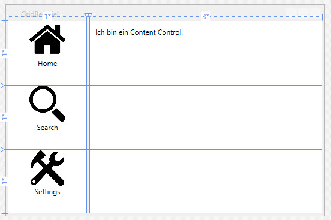

# Ein Layout mit Navigationsbereich erstellen 

## Aufgabe

Erstelle das folgende Layout. Auf der linken Seite befindet sich ein Navigationsbereich mit 3 Buttons. Rechts davon der Content-Bereich, in den bei Klick auf einen Navigationsbutton der entsprechende Content geladen wird. 



### Schritt 1

Erstelle ein `Grid` mit 3 Zeilen und 3 Spalten.

```xml 
<Grid.ColumnDefinitions>
    <ColumnDefinition Width="1*" />
    <ColumnDefinition Width="Auto"/> <!-- Breite passt sich dem Inhalt an-->
    <ColumnDefinition Width="3*"/>
</Grid.ColumnDefinitions>
<Grid.RowDefinitions>
    <RowDefinition Height="1*" />
    <RowDefinition Height="1*" />
    <RowDefinition Height="1*" />
</Grid.RowDefinitions>
```

### Schritt 2

In der ersten Spalte soll sich das Menu befinden. 

* Home 
* Search
* Settings 

Wir wollen für jedes Menu-Item einen `Button` verwenden mit passendem Text darunter. Die Buttons können mit Bilder versehen werden, damit das Menu ansprechend aussieht. Passende Icons findest du hier:  [Icons](https://de.freepik.com/freie-ikonen/schnittstelle)

**Tipp:** Verwende ein `StackPanel` um die Buttons und die Texte untereinander zu platzieren. 

```xml
<StackPanel Grid.Row="0">
    <Button Background="white" BorderThickness="0">
        <Image Width="60" Source="res/ico_home.png" />
    </Button> 
    <TextBlock Text="Home" TextAlignment="Center"/>
 </StackPanel>
```

### Schritt 3 

In der mittleren Spalte soll ein `GridSplitter` dafür sorgen, dass der Benutzer mit der Maus die Spaltenbreiten der ersten und dritten Spalte verändern kann, ohne die Dimensionen des Fensters verändern zu müssen.

```xml
<GridSplitter Grid.Column="1" Grid.RowSpan="3" Width="5" 
        Background="#FFF0F0F0" HorizontalAlignment="Center"/>
```

**Wichtig:** Achte darauf, dass sich der GridSplitter über alle 3 Zeilen erstreckt und dass du die Eigenschaft _HorizontalAlignment_ auf den Wert _Center_ setzst.

### Schritt 4 

In der 3. Spalte schliesslich, soll der Bereich geschaffen werden, in dem dynamisch, d.h. je nach gewähltem Menu, Content angezeigt wird. Wir wählen hierfür das `ContentControl`. 

```xml 
 <ContentControl Content="I'm a Content Control." 
        Grid.Column="2" Grid.RowSpan="3" Margin="10" />
```
### Schritt 5

Als letztes wollen wir auf die Klicks des Benutzers reagieren und im Content-Bereich die Information ausgeben, welcher Button angeklickt worden ist: 

* 'Home' wurde angeklickt.
* 'Search' wurde angeklickt.
* 'Settings' wurde angeklickt. 

Erstelle dazu im XAML-Code für jeden Button das _Click_-Attribut und programmiere dann im Code-Behind mit C# die Event-Handler. 


