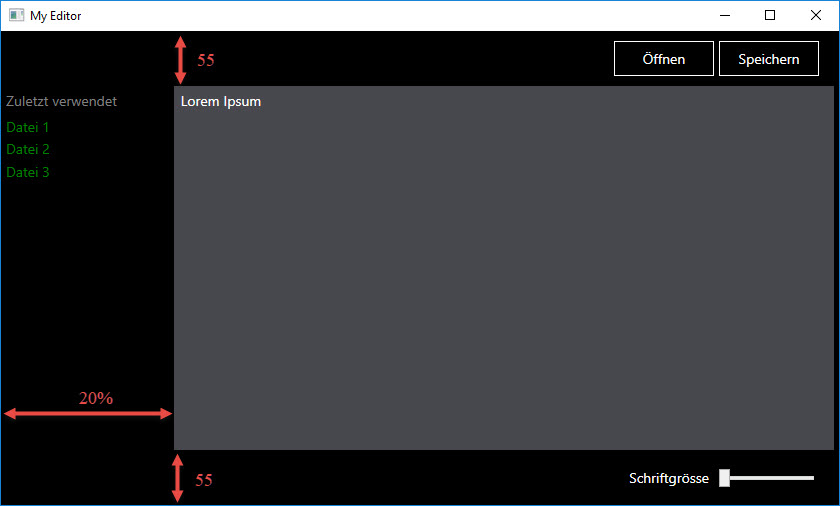

# Ein Layout für einen Editor erstellen 

## Aufgabe

Erstelle das Layout für einen Texteditor mit Schalftflächen oben und unten wie in der folgenden Abbildung ersichtlich. 



### Schritt 1

Erstelle zuerst die Grundstruktur des Layouts. Verwende dazu ein `Grid` mit 3 Zeilen und 2 Spalten.

* Die erste und dritte Zeile haben eine fixe Höhe von 55 Einheiten. 
* Die erste Spalte soll 20% der verfügbaren Breite einnehmen, die dritte Spalte entsprechend 80%. 

### Schritt 2

Platziere in der oberen Menuleiste die Buttons _Öffnen_ und _Speichern_, richte sie horizontal auf die rechte Seite aus und gestalte sie in Farbe und Grösse. 

### Schritt 3 

Im Hauptbereich des Editors soll der Anwender Texte schreiben können. Verwende hierfür ein `TextBox`-Control und hebe den Hintergrund dieses Bereiches farblich vom Rest der Oberfläche ab, damit der Anwender sieht, wo er den Cursor platzieren muss, um seinen Text zu tippen. 

### Schritt 4

In der unteren Menuleiste soll ein `Slider` dem Anwender die Möglichkeit geben, die Schriftgrösse zu verändern.

### Schritt 5

Der Editor soll dem Benutzer eine Liste mit den zuletzt verwendeten Dateien angezeigen. Diese Liste soll links vom Hauptbereich platziert werden. Erstelle drei bis vier Dummy-Einträge und verwende dazu das `ItemsControl`, ein von WPF zur Verfügung gestelltes Control zur Anzeige einer Auflistung von Elementen. 

```xml 
<ItemsControl Foreground="Green" Margin="5,0">
    <TextBlock Text="Datei 1" Margin="0,2" />
    <TextBlock Text="Datei 2" Margin="0,2" />
    <TextBlock Text="Datei 3" Margin="0,2" />
</ItemsControl>
``` 

## Zusatzaufgabe 

Um möglichst wenig redundanten XAML-Code zu erstellen, soll mit Styles gearbeitet werden. 

* Erstelle einen Style für die beiden Buttons (weisse Schriftfarbe, weisser Rahmen, schwarzer Hintergrund, Breite,...). 
* Verknüpfe die Buttons mit dem Style. 
* Lagere den Style in ein externes _Resource Dictionary_ aus. 

