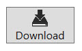
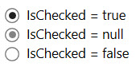
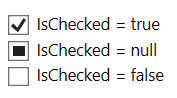

# Buttons verwenden

Die von `ContentControl` abgeleitete abstrakte Klasse `ButtonBase` ist die Basisklasse für Buttons. Darin definiert ist u.a. das _Click_-Event, welches überlicherweise gefeuert wird, sobald der Benutzer die Maustaste loslässt, nachdem er einen Button geklickt hat. 


## Der "normale" Button

Die Klasse `Button` definiert selbst lediglich drei Properties: _IsDefault_, _IsCancel_ und _IsDefaulted_. 

* Ist die Property _IsDefault_ eines Buttons auf _true_ gesestzt, wird beim Drücken der {Enter}-Taste der Click-Event des Buttons gefeuert.  

* Ist die Property _IsCancel_ eines Buttons auf _true_ gesestzt, wird beim Drücken der {Esc}-Taste der Click-Event des Buttons gefeuert.  

* Die dritte in der `Button`-Klasse definierte Eigenschaft _IsDefaulted_ ist read-only. Sie sagt aus, ob das Drücken der {Enter}-Taste den Click-Event auslöst oder nicht. Das heisst: Die _IsDefaulted_-Property eines Buttons ist genau dann _true_, wenn die _IsDefault_-Property _true_ ist UND das Control, auf dem aktuell der Fokus liegt, die {Enter}-Taste nicht akzeptiert. Befindet sich der Mauszeiger z.B. in einer TextBox, die Returns akzeptiert (Eigenschaft _AcceptsReturn_ ist _true_), dann ist die _IsDefaulted_-Property des Default-Buttons _false_.

Die _Content_-Eigenschaft eines Buttons ist vom Typ `Object`. Damit sind der Gestaltung eines Buttons (fast) keine Grenzen gesetzt. Zum Beispiel kann der Button ein StackPanel enthalten, worin ein Bild und ein TextBlock platziert sind. 

```xml
<Button>
    <StackPanel>
        <Image Source="res/download.png" Height="28"></Image>
        <TextBlock>Download</TextBlock>
    </StackPanel>
</Button>
```

Dies ergibt einen Button mit einem Bild und darunter stehendem Text. 




## Der ToggleButton 

Ein ToggleButton sieht auf den ersten Blick aus wie ein gewöhnlicher Button. Allerdings behält er seinen Status, sobald er geklickt wurde. ToggleButtons sind of in ToolBars zu finden. Beispielsweise enthält Microsoft Word in der ToolBar unter anderem ToggleButtons für _FETT_, _KURSIV_ und _UNTERSTRICHEN_. 

Die Klasse `ToggleButton` ist direkt von `ButtonBase` abgeleitet und definiert die Properties _IsChecked_ und _IsThreeState_. 

* Die _IsChecked_-Property ist nach dem Initialisieren des ToggleButtons per Default _false_. Klickt der Benutzer auf den ToggleButton, besitzt _IsChecked_ den Wert _true_. Klicke der Benutzer ein zweites Mal, besitzt _IsChecked_ wieder den Wert _false_. 8-ung: _IsChecked_ ist nicht vom Typ `bool`, sondern vom Typ `Nullable<bool>`. Das heisst, die Property kann neben _true_ und _false_ auch _null_ sein. 

* Mit _IsThreeState_ kann festgelegt werden, ob der ToggleButton zwei oder drei Status hat.  _IsChecked_ kann nur dann null sein, wenn die per Default auf _false_ gesetzte _IsThreeState_-Property auf _true_ gesetzt wird.

Nebst den beiden Properties _IsChecked_ und _IsThreeState_ definiert die Klasse `ToggleButton` die Events _Checked_ und _Unchecked_. Wie die Namen dieser beiden Events vermuten lassen, tritt _Checked_ auf, wenn _IsChecked_ den Wert _true_ annimmt und _Unchecked_ entsprechend dann, wenn _IsChecked_ auf _false_ gesetzt wird. 

**Hinweis**: Im Gegensatz zum Click-Event feueren die beiden Events _Checked_ und _Unchecked_ auch dann, wenn die _IsChecked_ Property durch C#-Code und nicht durch einen Mausklick gesetzt werden. 

## Der RadioButton 

`RadionButton` ist ein Subklasse von `ToggleButton` und erbt somit sowohl die Properties _IsChecked_ und _IsThreeState_ als auch die Events _Checked_ und _Unchecked_. Dabei besitzt ein RadioButton für alle drei möglichen Status eine eigene visuelle Darstellung (siehe Abbildung) .



Im Gegensatz zu ToggleButtons werden RadioButtons üblicherweise in Gruppen verwendet. Ein weiterer  Unterschied zum ToggleButton ist, dass der Benutzer einen selektierten RadioButton, der für _IsChecked_ den Wert _true_ hat, durch erneutes Klicken nicht deselektieren kann. Der Benutzer kann lediglich einen anderen RadioButton aus der Gruppe auswählen. RadioButtons werden automatisch gruppiert, wenn sie zum gleichen Elternelement gehören. In einer Gruppe von RadioButtons, kann immer nur genau ein RadioButton selektiert sein. So kann der Benutzer im folgenen Beispiel nur genau eine Farbe auswählen, da die drei RadioButtons Kinder des gleichen StackPanels sind. 

```xml
<StackPanel>
    <RadioButton Content="Rot" />
    <RadioButton Content="Grün" />
    <RadioButton Content="Blau" />
</StackPanel> 
```

Um RadioButtons, die zu unterschiedlichen Elternelementen gehören, zu einer Gruppe zusammenzufassen oder um RadioButtons innerhalb des gleichen Elternelements in mehrere Gruppen aufzuteilen, müssen sie mit der _GroupName_-Property explizit gruppiert werden. 

## Die CheckBox 

Was hat die CheckBox im Kapitel, in dem Buttons vorgestellt werden, verloren? Eine CheckBox verfügt über die drei Zustände "selektiert", "nicht selektiert" und "undefiniert",  was einem ToggleButton entspricht, dessen _IsThreeState_-Property _true_ ist. Folglich ist `CheckBox` von der Klasse `ToggleButton` abgeleitet. Eien CheckBox besitzt lediglich einen anderen Style und ein anderes ControlTemplate als ein ToggleButton und besitzt wie auch die Klasse `RadioButton` für alle drei möglichen Status der _IsChecked_-Property ein visuelles Erscheinungsbild. 



Während beim RadioButton und beim ToggleButton der Wert _null_ für die _IsChecked_-Eigenschaft selten gebraucht wird, ergibt dies bei der CheckBox in bestimmten Szenarien durchaus Sinn. Zum Beispiel dann, wenn die CheckBox eine Eigenschaft mehrerer Objekte repräsentiert und diese Eigenschaft nicht über alle Objekte gleich ist. Windows nutzt zum Beispiel im Dateieigenschaftsfenster für Eigenschaften wie _read-only_ eine CheckBox. Sind mehrere Dateien markiertt und einige dieser Dateien sind _read-only_ und andere nicht, ist der Wert für _IsChecked_ nicht _true_ oder _false_, sondern _null_.