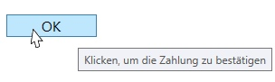
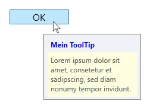

# ToolTips anzeigen

Ein ToolTip ist eine kleine Information, die angezeigt wird, sobald der Benutzer die Maus über eine Element bewegt. 

Die Klassen `FrameworkElement` und `FrameworkContentElement` besitzen beide zum Hinterlegen eines ToolTips die Property _ToolTip_ vom Typ `Object`. Dieser Property kann ganz einfach ein String zugewiesen werden. 

```xml
<Button Content="OK" ToolTip="Klicken, um die Zahlung zu bestätigen" />
```



Anstelle eines Strings lassen sich der _ToolTip_-Property aber auch komplexe Objekte zuweisen, wie zum Beispiel ein StackPanel, das selber weitere Elemente enthält. 

```xml
<Button Content="OK" Width="100">
    <Button.ToolTip>
        <StackPanel>
            <Label FontWeight="Bold" Content="Mein ToolTip" Foreground="Blue"/>
            <TextBlock Width="150" Height="75" TextWrapping="Wrap" Background="LightYellow" Padding="5">
                <TextBlock.Text> 
                    Lorem ipsum dolor sit amet, consetetur et sadipscing, sed diam nonumy tempor invidunt.
                </TextBlock.Text>
            </TextBlock>
        </StackPanel>
    </Button.ToolTip>
</Button>
```



Die `ToolTip`-Klasse bietet viele weitere Eigenschaften, z.B.:  

* Positionieren des ToolTips: _HorizontalOffset_, _VerticalOffset_, _Placement_. 
* Mit _IsOpen_ kann kontrolliert werden, ob der ToolTip anzeigt wird. Um einen ToolTip "manuell" zu schliessen, kann diese Eigenschaft auf _false_ gesetzt werden. 
* Mittels _HasDropShadow_ kann ein Schatten angezeigt werden. 

Überwacht werden kann der ToolTip mit den beiden Events _Opened_ und _Closed_.  