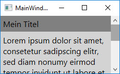

# Scrollen mit dem ScrollViewer

Die Klasse `ScrollViewer` kann verwendet werden, um ein Element in einen scrollbaren Bereich zu packen. `ScrollViewer` besitzt intern zwei Controls vom Typ `ScrollBar` zum horizontalen und vertikalen Scrollen. 

Die wichtisten Properties der Klasse `ScrollViewer` sind _HorizontalScrollBarVisibility_ und _VerticalScrollBarVisibility_. Diesen beiden Eigenschaften kann einer der folgenden vier Werte zugewiesen werden: 

* **Auto**: Die ScrollBar wird dann angezeigt, wenn der Inhalt grösser wird als die verfügbare Anzeige-Fläche.   

* **Disabled**: Die ScrollBar wird nicht anzeigt. Die Breite (_Width_) des Elements, das der _Content_-Eigenschaft des ScrollViewers zugewiesen ist, wird auf die Breite der zur Verfügung stehenden Anzeige-Fläche gesetzt, dito die Höhe (_Height_).

* **Hidden**:  Die ScrollBar wird nicht anzeigt. Allerdings läuft der Inhalt des dem ScrollViewer zugewiesenen Elements  über die verfügbare Anzeige-Fläche hinaus, da die _Width_- und die _Height_-Property des Inhalts nicht wie bei _Disabled_ der zur Verfügung stehenden Anzeige-Fläche angepasst wird.  

* **Visible**: Die ScrollBlar wird immer angezeigt, auch dann, wenn die verfügbare Anzeige-Fläche eigentlich gross genug wäre, um den Inhalt ohne Scrolling anzeigen zu können. 

Im folgenden Beispiel wird die vertikale Scrollbar immer angezeigt. Die horizontale Scrollbar dagegen wird nie angezeigt. Durch den Wert _Disabled_ für _HorizontalScrollBarVisibility_ wird erreicht, dass die Width-Property des dem ScrollViewer zugewiesenen StackPanels automatisch auf die Breite der zur Verfügung stehenden Fläche gesetzt wird. Den TextBlock-Objekten steht somit auch nur die sichtbare Breite zur Verfügung, wodurch ihr Text umbrochen wird. 

```xml
<ScrollViewer VerticalScrollBarVisibility="Visible" HorizontalScrollBarVisibility="Disabled">
        <StackPanel>
            <TextBlock Background="Gray" Padding="5">
                Mein Titel
            </TextBlock>
            <TextBlock Background="LightGray" TextWrapping="Wrap" Padding="5">
                Lorem ipsum dolor sit amet ...
            </TextBlock>
        </StackPanel>
    </ScrollViewer>
```  

