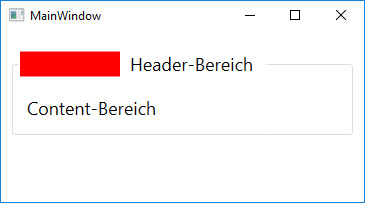

# Gruppieren mit der GroupBox

Die `GroupBox` wird verwendet, um zusammengehörende Controls zu gruppieren und ist damit ein wichtiges Werkzeug für die übersichtliche Strukturierung und Gestaltung von grafischen Benutzeroberflächen. 

Die GroupBox ist abgeleitet von `HeaderedContentControl` und besitzt als solches nebst einen Content-Bereich mit der Property _Header_ zusätzlich noch einen Titel-Bereich. Wie die Content-Eigenschaft ist auch die Header-Eigenschaft vom Typ `Object`. Das heisst, wir können dem Header-Bereich ein beliebiges Element zuordnen. 

Im folgenden Beispiel wurde im Header-Bereich ein Layout Container (ein StackPanel) platziert und darin wiederum ein rot ausgefülltes Rectangle sowie ein TextBlock.

```xml
<StackPanel>
    <GroupBox Margin="10" Padding="10">
        <GroupBox.Header>
            <StackPanel Orientation="Horizontal">
                <Rectangle Width="100" Height="25" Fill="Red" />
                <TextBlock Text="Header-Bereich" Margin="10"/>
            </StackPanel>
        </GroupBox.Header>
        Content-Bereich
    </GroupBox>
</StackPanel>
```

Es ergibt sich folgenes Layout: 



## Weitere HeaderedContentControls

Nebst der GroupBox leiten zwei weitere Klassen der WPF von `HeaderedControl` ab: 

* `Expander`
* `TabItem`