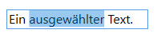
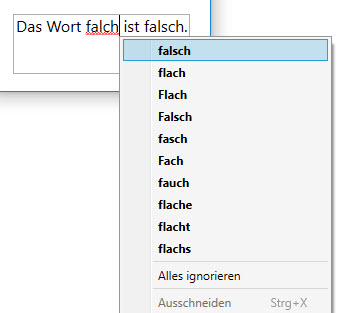

# Die TextBox 

Die Klasse `TextBox` erbt von der Klasse `TextBoxBase`, die wiederum direkt von `Control` abgeleitet ist. 

## Text eingeben und editieren 

Nebst der wohl wichtigsten Eigenschaft _Text_, die den vom Benutzer eingegebenen Text entgegennimmt, bietet die TextBox viele weitere nützliche Properties.  

* **_TextWrapping_** - legt fest, wie der Text innerhalb der TextBox umbrochen werden soll (mögliche Werte: _NoWrap_, _Wrap_, _WrapWithOverflow_).
* **_AcceptsReturn_** - legt fest, ob der Benutzer mit der {ENTER}-Taste ein Zeilenumbruch einfügen kann.
* **_AcceptsTab_** - legt fest, ob der Benutzer mit der {TAB}-Taste ein Tabstoppzeichen einfügen kann.
* **_CanUndo_** - legt fest, ob der Benutzer die vorhergehende Eingabe rückgängig machen kann.
* **_IsUndoEnabled_** - legt fest, ob der Undo-Mechanismus eingeschaltet ist oder nicht. 
* **_UndoLimit_**  - legt maximale Grösse des Undo-Stacks fest. 
* **_UndoLimit_**  - legt maximale Grösse des Undo-Stacks fest. 

## Text markieren 

Es gibt einige Properties, die dem Programmierer den Zugriff auf bestimmte Textabschnitte erleichtern. 

* **_SelectionStart_** - legt den Aussgangspunkt für eine Textmarkierung fest. 
* **_SelectionLength_** - legt die Anzahl Zeichen für eine Textmarkierung fest. 
* **_SelectedText_** - gibt den aktuell in der TextBox markierten Text zurück.

```csharp
tBox.Focus();
tBox.SelectionStart = 4;
tBox.SelectionLength = 12;
```



Das Gleiche lässt sich freilich auch durch Aufruf der Methode _Select_ erreichen: 

```csharp
tBox.Focus();
tBox.Select(4, 12);
```
## Rechtschreibprüfung

Mit der Attached Property _SpellCheck.IsEnabled_ kann für eine TextBox die Rechtschreibprüfung aktiviert werden. Falsch geschriebene Wörter werden dann rot unterstrichen und über das Kontextmenu der Maus werden Korrekturen vorgeschlagen. 

```xml
 <TextBox SpellCheck.IsEnabled="True">Das Wort falch ist falsch.</TextBox>
 ```



## Events 

Die TextBox definiert neben Properties natürlich auch Events. Die beiden wichtigsten und nützlichsten Events sind sicherlich die folgenden: 

* **_SelectionChanged_** - feuert, wenn die Textauswahl sich geändert hat. 
* **_TextChanged_** - feuert, wenn der Inhalt der _Text_-Property geändert hat.
