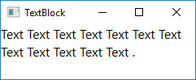
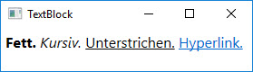
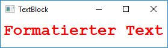
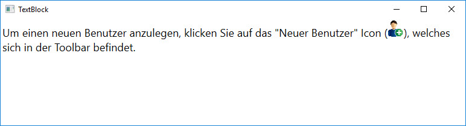

# Der TextBlock

 Die `TextBlock`-Klasse ist direkt von `FrameworkElement` abgleitet, liegt aber dennoch im Namespace _System.Windows.Controls_. Mit ihr lassen sich Text-Elemente  anzeigen und formatieren. 
 
## Darstellen von Text

 In der einfachsten Verwendung zeigt ein TextBlock einen beliebigen String an. 

 ```xml
<TextBlock TextWrapping="Wrap">Text Text Text Text Text Text Text Text Text</TextBlock>
 ```
 


 ### Inlines und Blocks respektive TextBlock vs. FlowDocument

Text-Elemente werden in der WPF zwei Gruppen unterteilt: Inlines und Blocks. Ein `TextBlock`-Element enthält nur Inlines wohingegen ein `FlowDocument` nur Blocks enthält. Das heisst, dass der in einem TextBlock angegebe Text samt Formatierung in ein FlowDocument gepackt werden kann. 

Somit eignet sich ein `TextBlock` zum Darstellen kleinerer Textabschnitte, oder genauer gesagt, zum Darstellen eines einzigen Blocks während für die Darstellung grösserer  Textabschnitte  die Klasse `FlowDocument` vorgesehen ist. 
 
 ## Formatierung mit Spans 

Ein Text lässt sich einfach formatieren indem der _Inlines_-Property einer TextBlock-Instanz Elemente vom Typ `Inline` hinzugefügt werden.  Mit den von der Klasse `Inline` abgeleiteten `Span`-Elementen können einzelne Zeichen eines Textes mit einer Formatierung versehen werden. 

Das folgende Beispiel zeigt die Verwendung der Spans `Bold`, `Italic`, `Underline` und `Hyperlink`.

```xml
<TextBlock Name="tBlock" Margin="5">
    <Bold>Fett.</Bold>
    <Italic>Kursiv.</Italic>
    <Underline>Unterstrichen.</Underline>
    <Hyperlink>Hyperlink.</Hyperlink>
</TextBlock>
```

**8-ung:** Beachte, dass zwischen den einzelnen Wörtern ein Leerschlag gerendert wird, obwohl in XAML nirgends ein Leerschlag eingefügt wurde. Wenn in XAML zwischen Span-Elementen Zeilenumbrüche vorhanden, wird zur Laufzeit für jeden Zeilenumbruch ein zusätzliches Leerzeichen eingefügt. 



Aufgrund der Tatsache, dass die `Span`-Klasse selber eine `Inlines`-Property besitzt, können Span-Elemente beliebig verschachtelt werden. 

```xml
<Bold>Ge</Bold><Italic>mi</Italic><Underline>scht</Underline> <Hyperlink>formatiert.</Hyperlink>
```


### Das Inline-Element "Run"

Um die im obigen Beispiel in XAML definierte Textausgabe mit C# zu erstellen, muss jedes `Span` in ein `Run`-Objekt gepackt werden. Objekte vom Typ `Run` sind die einzigen Inline-Objekte, welche den eigentlichen Text enthalten können. 

```csharp
tBlock.Inlines.Add(new Bold(new Run("Fett.")));
tBlock.Inlines.Add(new Run(" "));
tBlock.Inlines.Add(new Italic(new Run("Kursiv.")));
tBlock.Inlines.Add(new Run(" "));
tBlock.Inlines.Add(new Underline(new Run("Unterstrichen.")));
tBlock.Inlines.Add(new Run(" "));
tBlock.Inlines.Add(new Hyperlink(new Run("Hyperlink.")));
```

 ## Formatierung mit den Properties der TextElement-Klasse

 Die Klasse `Inline` leitet von `TextElement` ab, welche einige interessante Properties besitzt, um Text zu formatieren.

 * **_FontFamily_**  - definiert die Schriftart. 
 * **_FontSize_**  - vom Typ `double`, legt die Schriftgrösse fest.
 * **_FontStretch_**  - definiert die Laufweite des Textes und damit den Abstand der Zwischenräume zwischen den Buchstaben (nicht jede Schriftart unterstützt dies). 
 * **_FontStyle_**  - legt den Stil der Schrift fest (_Normal_, _Italic_, _Oblique_).
 * **_FontWeight_**  - wird für die Dicke der Schrift verwendet (_Normal_, _Bold_, _UltraBold_). 
 * **_Foreground_**  - vom Typ `Brush`, definiert die Farbe des Textes. 
 
```xml
<TextBlock Name="tBlock" Margin="5">
    <Run FontFamily="Courier New" 
            FontWeight="UltraBold" 
            FontSize="26"
            Foreground="red">Formatierter Text.
    </Run>   
</TextBlock>
```


 
Diese _FontXXX_-Properties sind WPF-intern als Attached Properties implementiert und haben in den Metadaten das _Inherits_-Flag gesetzt. Das bedeutet, dass sie praktischerweise auf Kind-Elemente vererbt werden. 

```xml
<StackPanel TextElement.FontFamily="Courier New">
    <TextBlock>Formatierter Text.</TextBlock>
</StackPanel>
```
### InlineUIContainer

Mit der Klasse `InlineUIContainer` lassen sich beliebige UIElemente (z.B. Images) in einen Text integrieren.

```xml
<TextBlock TextWrapping="Wrap">
    Um einen neuen Benutzer anzulegen, klicken Sie auf das "Neuer Benutzer" 
    Icon (<InlineUIContainer><Image Source="res/new-user.jpg" Height="25" />
    </InlineUIContainer>), welches sich in der Toolbar befindet.
</TextBlock>

```



## Weitere Möglichkeiten zur Formatierung

Die WPF bietet unzählige weitere Klassen und Eigenschaften zur Formatierung von Text. Die Möglichkeiten gehen so weit, dass sogar einzelne Buchstaben eines Textes transformiert und animiert werden können. Hilfe dazu findet sich im Internet und/oder in Büchern über die WPF. 


