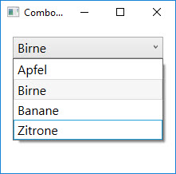
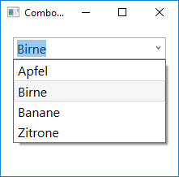
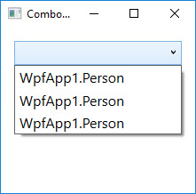
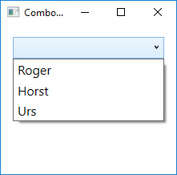

# Die ComboBox  

Eine `ComboBox` ermöglicht es dem Benutzer, einen Wert aus einer Liste auszuwählen. 

Für die Elemente (Items) der ComboBox gibt es die Klasse `ComboBoxItem`. Jedoch lässt sich auch jedes beliebige andere Objekt zur _Items_-Collection einer ComboBox hinzufzügen. 

```xml
<ComboBox>
    <ComboBoxItem>Apfel</ComboBoxItem>
    <ComboBoxItem>Birne</ComboBoxItem>
    <ComboBoxItem>Banane</ComboBoxItem>
    <ComboBoxItem>Zitrone</ComboBoxItem>
</ComboBox>
```

Wird die _IsEditable_-Property der ComboBox auf _true_ gesetzt, kann der Benutzer den Text oben in der Auswahlbox ändern. Wird neben _IsEditable_ zusätzlich _IsReadOnly_ auf _true_ gesetzt, lässt sich der Text in der Auswahlbox immer noch selektieren, aber nicht mehr ändern. 

| IsEditable = false    | IsEditable = true       |
| --------------------- | ----------------------- |
|  |    |


Falls die Objekte in der ComboBox vom Typ `UIElement` abgeleitet sind, werden die Elemente durch die ComboBox gezeichnet. Das bedeutet, dass eine ComboBox auch Bilder darstellen kann. 


Für Objekte, die nicht von `UIElement` abgeleitet sind, wird in der CombBox das Ergebnis der _ToString()_-Methode dargestellt.  Dabei handelt es sich in den meisten Fällen um den Klassennamen der Objekte.

Nehmen  wir als Beispiel drei Objekte vom Typ `Person` mit den Eigenschaften _Vorname_ und _Nachname_.     

```csharp
Person p1 = new Person { Vorname = "Roger", Nachname = "Erni" };
comboBox.Items.Add(p1);

Person p2 = new Person { Vorname = "Horst", Nachname = "Lang" };
comboBox.Items.Add(p2);

Person p3 = new Person { Vorname = "Urs", Nachname = "Nussbaumer" };
comboBox.Items.Add(p3);
```

Die ComboBox zeigt für jedes der drei Elemente jeweils deren  Klassennamen an. 



Dies ist meist nicht das, was wir möchten. Zum Glück lässt sich das aber relativ einfach mit Hilfe der Eigenschaft _DisplayMemberPath_ ändern.

## DisplayMemberPath

Mit der Eigenschaft _DisplayMemberPath_ können wir die ComboBox dazu bringen, nicht das Ergebnis der _ToString()_ Methode darzustellen, sondern den Wert einer bestimmten Eigenschaft. 

```csharp
comboBox.DisplayMemberPath = "Vorname";
```

Damit teilen wir der ComboBox mit, dass wir den Vornamen agezeigt haben möchten.




## Die TextSearch-Klasse 

Mit der Klasse `TextSearch` kann den einzelnen Items in einer ComboBox ein String zugewiesen werden, der in der Auswahlbox angezeigt werden soll, sobald das betreffende Item durch den Benutzer selektiert worden ist. 

Zum Beispiel kann damit bei einer ComboBox, die Bilder enthält, dafür gesorgt werden, dass anstelle des selektierten Bildes ein Text in der Auswahlbox erscheint. Dazu wird bei jedem Item die Property _TextSearch.Text_ gesetzt. 

```xml
<ComboBox IsEditable="True">
    <Image TextSearch.Text="Hund" Source="images/Hund.jpg" />
    <Image TextSearch.Text="Katze" Source="images/Katze.jpg" />
    <Image TextSearch.Text="Maus" Source="images/Maus.jpg" />
</ComboBox>
```

Wird nun das Bild der Katze ausgewählt, wird in der Auswahlbox der Text "Katze" dargestellt (statt des Bildes).   


**Hinweis:** Beachte, dass die Property _IsEditable_ auf **_true_** gesetzt sein muss, damit die TextSearch-Klasse ihren Dienst tut. 
