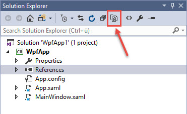
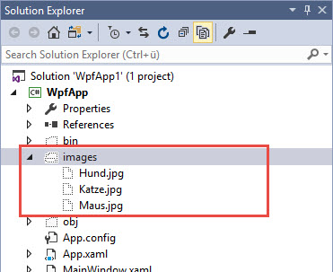
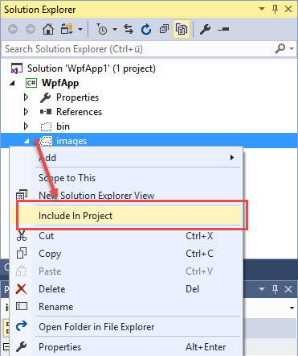
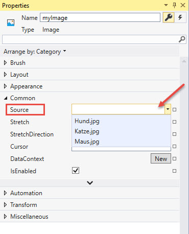
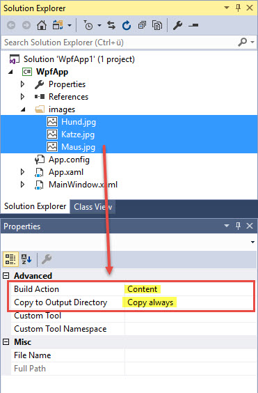

# Bilder anzeigen mit der Image-Klasse

Die Klasse `Image` wird verwendet, um in einer WPF-Anwendung ein Bild anzuzeigen. `Image` ist direkt von `FrameworkElement` abgeleitet.

## Source-Property

Die wichtigste Eigenschaft von Image ist _Source_ vom Typ `ImageSource`. Dank Type-Convertern kann dieser Property in XAML einfach ein Pfad zu einer Bilddatei zugewiesen werden, ein Converter sorgt dann dafür, dass das Bild angezeigt wird. 

```xml
<Image Name="myImage" Source="c:\\temp\\hund.jpg" />
```


In C# kann der _Source_-Property bspw. ein `BitmapImage`-Objekt (Namespace _System.Windows.Media.Imaging_) zugewiesen werden. `BitmapImage` ist indirekt abgleitet von `ImageSource`. 

```csharp
string filePath = "c:\\temp\\hund.jpg";
BitmapImage bi = new BitmapImage();
bi.BeginInit();
bi.UriSource = new Uri(filePath);
bi.EndInit();
myImage.Source = bi;
````

## Bilder als Resource integrieren

Wenn wir die Anwendung verteilen haben wir wahrscheinlich das Problem, dass beim Kunden im Verzeichnis _c:\temp_ das Bild _hund.jpg_ nicht vorhanden ist und unser Bild somit nicht angezeigt werden kann. Eine Möglichkeit, dieses Problem zu umgehen, besteht darin, das/die Bilder/er als Resource in die Anwendung zu integrieren. 

Dazu erstellen wir ein Verzeichnis für die Bilder und integrieren es wie folgt in unser Projekt. 

1. Im Solution-Explorer > _Show All Files_.  

    
    
    Es werden nun auch die Verzeichnisse und Dateien angezeigt, die (noch) nicht zum Projekt gehören. 

    

2. Rechte Maustaste auf das Verzeichnis > _Include In Project_.

    

3. Die Bilder sind nun Resource im Projekt integriert und können über das Properties-Window der Source-Eigenschaft des Images zugewiesen werden. 

    

### Achtung: Resource-Dateien werden in die Executable hineinkompiliert 

Beachte, dass als Resource in ein Projekt eingebundenen Dateien in die exe- respektive dll-Datei kompiliert werden und zwar nicht nur jene Biler, die wir in unserem GUI auch tatsächlich verwenden, sondern alle sich im Resourcen-Verzeichnis befindlichen Dateien. **Dies kann eine exe-Datei enorm aufblähen!** 

## Bilder als Content integrieren 

Um die exe-Datei klein zu halten, können Dateien alternativ als _Content_ eingebunden werden. Content-Files sind "standalone"-Dateien, welche nicht ins Executable kompiliert werden, sondern zusammen mit der Applikation ausgeliefert werden müssen. 

Die Bilder aus dem Beispiel oben können im Properties-Window als _Content_-Files definiert werden. Dazu werden die Bilder im Solution Explorer mit der Maus markiert  und im Properties-Window die Build Action auf _Content_ gesetzt. Ausserdem sollten die Bilder ins Output-Directory kopiert werden. Die entsprechende Einstellung ist _Copy always_ (oder: _Copy if newer_).

