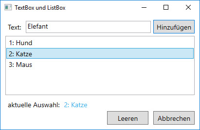
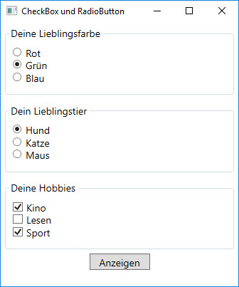
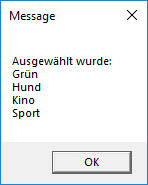
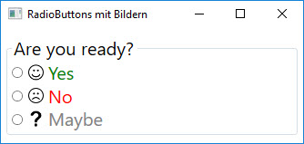
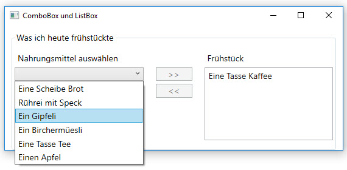

# Aufgabensammlung: Controls  

**Zu Beginn:**
* Arbeite lokal.Erstelle z.B. einen Ordner "C:\Aufgaben_WPF\" und setze in Visual Studio über das Menu _Tools_ > _Options..._ > _Projects and Solutions_ die _Projects Location_ auf diesen Pfad. 
* Erstelle für jede Aufgabe ein **neues Projekt in derselben Projektmappe**. Dazu am einfachsten im Solution Explorer Klick mit rechter Maustaste auf die Solution und dann _> Add > New Project…_.
* **Tipp:** Bei mehreren Projekten innerhalb einer Solution kann das Start-Projekt (also das Projekt, das bei Klick der Taste F5 starten soll) wie folgt festgelegt werden: rechte Maustaste auf das betreffende Projekt und dann  _> Set as StartUp Project_. 

## Aufgabe 1

### `TextBox` und `ListBox` verwenden

Erstelle eine WPF-Anwendung wie im Bild unten gezeigt. Der in einer TextBox eingegebene Text soll zu einer ListBox hinzugefügt werden. 



#### Anforderungen

* Die eingegebenen Texte sollen in der ListBox aufnummeriert werden (1: Erster Eintrag, 2: Zweiter Eintrag, usw.) 
* Der Cursor soll jedes Mal zurück in die TextBox gesetzt werden, nachdem der Benutzer „Hinzufügen“ geklickt hat, damit gleich die nächste Eingabe gemacht werden kann.
* Aktuelle Auswahl anzeigen:  
  * Wird ein Text in der ListBox ausgewählt, soll dieser unterhalb der ListBox angezeigt werden.  
* Der Benutzer kann hinzugefügte Elemente aus der ListBox löschen, indem er auf den  _Leeren_-Button klickt.
* Wenn der Benutzer den _Abbrechen_-Button klickt, soll sich das Formular schliessen (d.h. die Applikation wird beendet). 


#### Tipps

Der `+` Operator verkettet `String`-Objekte.

```CSharp 
string adresse = "Luzernerstrasse 75"; 
myTextBox.Text = "Die Adresse ist: " + adresse;
```

Die ListBox verwaltet ihre Elemente in einer `ItemCollection` und bietet über die Eigenschaft _Items_ Zugriff darauf an. 

```CSharp
myListBox.Items.Add("Ein Eintrag");
```

#### Kontrolliere von nun an bei jeder Aufgabe: 

* Sind Projektname und Name des Windows sinnvoll gewählt?
* Sind die Objektnamen der Controls (z.B. der Labels, TextBox, ListBox) sinnvoll und sprechend gewählt?
* Stimmt die Tab-Reihenfolg, d.h. die Reihenfolge, in der die verschiedenen Controls mit der Tabulator-Taste „angesprungen“ werden? (siehe Eigenschaft _TabIndex_ der Klasse `Control`)
* Sind der Default- und der Cancel-Button gesetzt? (siehe Eigenschaften _IsDefault_ und _IsCancel_ der Klasse `Button`)

## Aufgabe 2 

### `CheckBox` und `RadioButton` verwenden

Erstelle eine Anwendung mit Kontrollkästchen und Optionsfeldern. Bei den Optionsfeldern soll es zwei Gruppen geben. 



#### Anforderungen 

* Beim Klick auf den  _Anzeigen_-Button soll in einer MessageBox ausgegeben werden, was alles ausgewählt wurde. 




#### Tipps 

* Die Eigenschaft _IsChecked_ gibt _true_ zurück, wenn eine CheckBox/ein RadioButton ausgewählt ist. 
* Versuche mit möglichst wenig _if_-Statements auszukommen. Setze stattdessen die _foreach_-Schleife ein um an die Kind-Elemente eines Containers zu gelangen. 

```CSharp
foreach (UIElement elem in myContainer.Children)
{
  // [...]
}
```

## Aufgabe 2b

### `RadioButton` mit Bildern gestalten 

Deine Aufgabe ist es, mit XAML folgende Benutzeroberfläche zu gestalten (es braucht keine Logik implementiert zu werden).



#### Anforderungen

* Gruppiere die Radiobuttons innerhalb einer `GroupBox` und beschrifte diese mit "Are you ready?".
* Setze für jeden Radiobutton eine unterschiedliche Schriftfarbe.  
* Füge bei jedem Radiobutton vor der Beschriftung ein Bild ein (passende Bilder findest du hier:  [Icons](https://de.freepik.com/freie-ikonen/schnittstelle)).
* Sorge für etwas Abstand zwischen Bild und Text (_margin_, _padding_). 

## Aufgabe 3 

### `ComboBox` und `ListBox` verwenden

Erstelle eine Frühstück-Anwendung _„Was ich heute frühstückte“_ mit einer Nahrungsmittel-ComboBox (mit Einträgen z.B. "Eine Tasse Kaffe", "Ein Gipfeli", "Ein Apfel") und mit einer Frühstücks-ListBox für die gegessenen Nahrungsmittel sowie mit zwei Buttons dazwischen („>>“, „<<“), zum Hin- und Herschieben der Einträge. 



#### Anforderungen 

* Die beiden Buttons sollen dynamisch bei Veränderung der Situation aktiviert/deaktiviert werden (Eigenschaft _IsEnabled_ von `Button`), z.B. wenn rechts in der ListBox noch kein Eintrag vorhanden ist, kann der Button „<<“ deaktiviert werden, weil es ja gar nichts nach Links schieben gibt.
* Ein Doppelklick auf einen ListBox-Eintrag soll wie ein Löschaufruf wirken, d.h. der doppelgeklickte Eintrag wird aus der ListBox gelöscht und wieder nach links in die Nahrungsmittel-Liste zurückgeschoben. 
* Auch mit der {Delete}-Taste sollen Einträge aus der ListBox gelöscht und zurück in die ComboBox verschoben werden können.
* Nach dem Löschen eines ListBox-Eintrags soll automatisch der darunterliegende Eintrag selektiert sein (oder der darüber liegende, wenn keiner mehr darunter war).
* Der Default-Button (Eigenschaft _IsDefault_ von `Button`) soll dynamisch je nach Veränderung der Situation gesetzt werden, d.h. wenn der Fokus links auf der ComboBox liegt, dann wird der Button >> zum Default-Button und wenn der Fokus rechts auf ListBox liegt, wird es der Button <<.

## Aufgabe 4

### Mehrfacheingaben erkennen (todo)

 