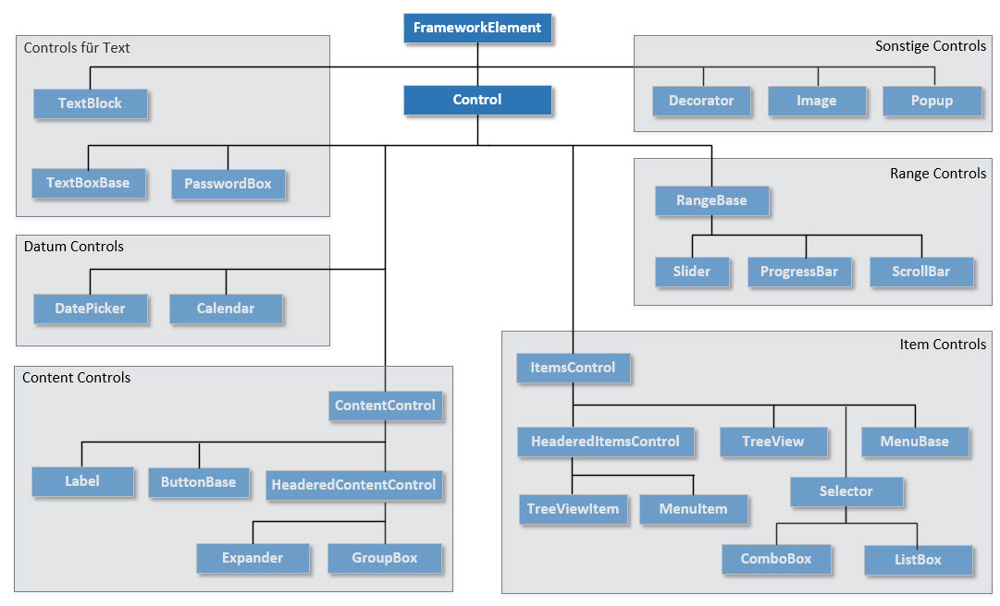

# Controls

Die WPF stellt viele vordefinierte Controls zur Verfügung, die  sogenannten _Built-in-Controls_. Einige davon, z.B. die Layout Panels (StackPanel, Grid, etc.) wurden bereits im Kapitel [02 XAML](../02%20XAML) beschrieben. In den folgenden Kapiteln werden einige weitere wichtige Controls der WPF vorgestellt. 

## Übersicht

Im Gegensatz zu Windows Forms ist bei der WPF nicht alles Sichtbare zwingend ein Control, sondern ein Visual. Ein Visual ist ein beliebiges Objekt einer von `Visual` abgeleiteten Klasse. Die zentrale Klasse der WPF, die über `UIElement` von `Visual` erbt, ist die Klasse `FrameworkElement`.

Als Überblick zeigt die folgende Abbildung einen Ausschnitt aus der Klassenhierarchie. 

Auf der Abbildung wurden die Controls in Gruppen eingeteilt:  

* **Content Controls**: Diese Controls erben von `ContentControl` und besitzen eine Property _Content_ vom Typ `Object`. 

* **Item Controls**: Diese Controls erben von der Klasse `ItemsControl` und besitzen eine Property namens _Items_, die mehrere Elemente vom Typ `Object` verwaltet. 

* **Controls zur Textdarstellung und -bearbeitung**: Controls zur Textdarstellung und -bearbeitung wie `TextBox` oder `TextBlock`. 

* **Datum Controls**: Controls zum Darstellen eines Datums, z.B. `Calendar` und `DatePicker`.

* **Range Controls**: Range Controls haben einen Wertebereich und erben von der Klasse `RangeBase`. Ein Beispiel für ein Range Control ist der `Slider`. 

* **Sonstige Controls**: Sonsite Controls, die nicht von `Control` abgeleitet sind, aber vom Typ `FrameworkElement` sind und sich im Namespace _System.Windows.Controls_ befinden.  

<!-- 

* wichtigste Controls vorstellen (analog Dokument "Visual Studio" vom m318er-Kurs)
* Ereignisverarbeitung (Event-Handler) darlegen

* Einbinden von Bildern: 
    * Verzeichnis im Projekt-Root erstellen 
    * Bilder da hinein kopieren
    * Verzeichnis in Projekt einbinden (Solution Explorer: > Show all files > rechte Maustaste auf Bilder-Ordner > Include in Project)
    * Bild kann dann übers Properties-Window auf dem Image-Control ausgewählt werden (> Common > Source)
-->