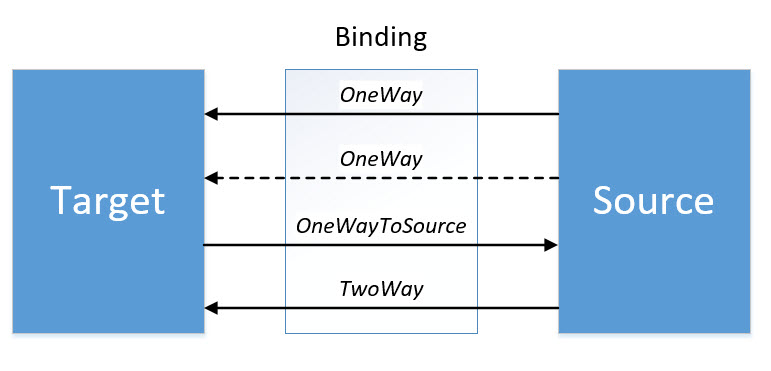
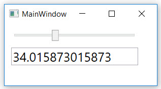

# Elementbindung (UI-Elemente als Quelle)

 Bei der Elementbindung wird die Eigenschaft eines UI-Elements an die Eigenschaft eines anderen UI-Elements gebunden. Dies passiert über die Eigenschaft _ElementName_, d.h. wir müssen der Datenquelle einen Namen geben und können dann beim Ziel-Element das Binding einrichten. 
 
Im folgenden Beispiel wird der aktuelle Wert eines Sliders (Quelle) an eine TextBox gebunden (Ziel). Über die Eigenschaft _Path_ wird dabei definiert, welche Eigenschaft der Quelle "angezapft" werden soll. Die angezapfte Eigenschaft muss dabei  **immer** eine öffentliche (public) Eigenschaft sein, mit Getter und Setter. 

 ```XML 
<StackPanel>
    <Slider Name="mySlider" />
    <TextBox Text="{Binding ElementName=mySlider, Path=Value}" />
</StackPanel>
```

Als Resultat dieses Bindings sehen wir sofort eine Änderung in der TextBox, wenn der Slider verschoben wird. 
<!-- 
 <video width="320" height="240" controls>
    <source src="res/video01.mp4" type="video/mp4">
    Your browser does not support the video tag.
</video> 
-->

[](res/video01.mp4 "Video")

## Richtung des Bindings 

Mit der _Mode_-Property der `Binding`-Klasse kann die Flussrichtung eines Data Bindings festgelegt werden. Es werden vier verschiedene Richtungen unterstützt: 

1. **OneWay**: Das Target wird aktualisiert, wenn sich die Source ändert. 

2. **OneTime**: Das Target wird einmalig mit dem Wert der Source initialisiert.

3. **OneWayToSource**: Die Source wird aktualisiert, wenn das Target sich ändert. 

4. **TwoWay**: Das Target wird aktualisiert, wenn sich die Source ändert und umgekehrt wird die Source aktualisert, wenn sich das Target ändert. 

    


Als **Default** Mode wird _OneWay_ verwendet bei Elementen, deren _BindsTwoWayByDefault_-Eigenschaft in den Metadaten auf _true_ gesetzt ist, z.B. bei einer TextBox. Andernfalls wird der Mode _TwoWay_ verwendet, z.B. beim Slider. 

Das folgende Beispiel zeigt ein _OneWay_ Binding. Änderungen am Slider werden in von der Textbox übernommen, aber nicht umgekehrt. 

```XML
<Slider Name="SourceSlider" Minimum="0" Maximum="100" />
<TextBox Name="TargetTxtBox" Text="{Binding ElementName=SourceSlider, Path=Value }" />
```

Mit _Mode=TwoWay_ hingegen funktioniert das Binding in beide Richtungen:

```XML
<Slider Name="SourceSlider" Minimum="0" Maximum="100" />
<TextBox Name="TargetTxtBox" Text="{Binding ElementName=SourceSlider, Path=Value, Mode=TwoWay }" />
```

 

 ## UpdateSourceTrigger 

 **Work in Progress** 

* Theorie Input: Huber, Seite 654 
* Beispiel von oben (Slider) weiterführen, eignet sich hervorragend ;)