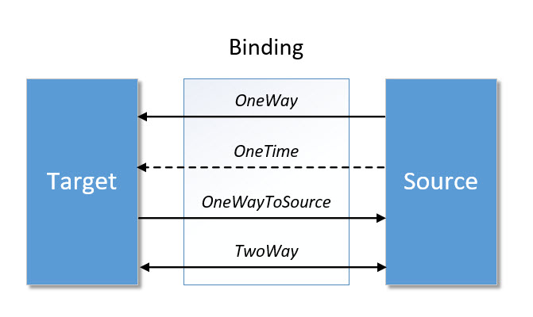
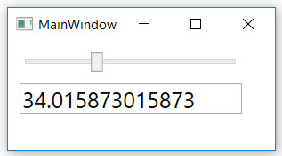

# Richtung eines Bindings 

Mit der _Mode_-Property der `Binding`-Klasse kann die Flussrichtung eines Data Bindings festgelegt werden. Es werden vier verschiedene Richtungen unterstützt: 

1. **OneWay**: Das Target wird aktualisiert, wenn sich die Source ändert. 

2. **OneTime**: Das Target wird einmalig mit dem Wert der Source initialisiert.

3. **OneWayToSource**: Die Source wird aktualisiert, wenn das Target sich ändert. 

4. **TwoWay**: Das Target wird aktualisiert, wenn sich die Source ändert und umgekehrt wird die Source aktualisiert, wenn sich das Target ändert. 

    

Als **Default** Mode wird _OneWay_ verwendet bei Elementen, deren _BindsTwoWayByDefault_-Eigenschaft in den Metadaten auf _false_ gesetzt ist, z.B. bei einem Slider. Andernfalls wird der Mode _TwoWay_ verwendet, z.B. bei einer TextBox. 

**Beispiel**

Das folgende Beispiel zeigt ein _OneWay_ Binding. Änderungen am Slider werden von der Textbox übernommen, aber nicht umgekehrt. 

```XML
<Slider Name="SourceSlider" Minimum="0" Maximum="100" />
<TextBox Name="TargetTxtBox" Text="{Binding ElementName=SourceSlider, Path=Value }" />
```

Mit _Mode=TwoWay_ hingegen funktioniert das Binding in beide Richtungen:

```XML
<Slider Name="SourceSlider" Minimum="0" Maximum="100" />
<TextBox Name="TargetTxtBox" Text="{Binding ElementName=SourceSlider, Path=Value, Mode=TwoWay }" />
```

 