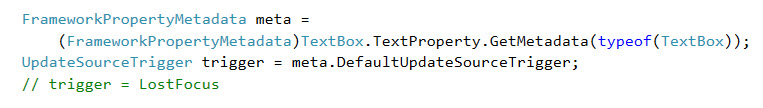

 # Der UpdateSourceTrigger 

Bei den [Binding-Modes](../04%20Richtung%20des%20Bindings/README.md) _TwoWay_ und _OneWayToSource_ hat das Binding die Aufgabe, die Source-Property bei einer Änderung der Target-Property zu aktualisieren. Der Zeitpunkt, d.h. **wann** die Aktualisierung erfolgen soll, kann über die _UpdateSourceTrigger_-Eigenschaft des Binding-Objekts festgelegt werden. Vier Werte sind möglich: 

1. **PropertyChanged**: Die Source-Property wird aktualisiert, sobald sich die Target-Property ändert. 

2. **LostFocus**: Die Source-Property wird erst dann aktualisiert, wenn das UI-Element mit der Target-Property den Fokus verliert.  

3. **Explicit**: Die Source-Property wird erst dann aktualisiert, wenn explizit die _UpdateSource_-Methode der zugehörigen _BindingExpression_ aufgerufen wird. Hier muss der Programmierer sich selber um die Aktualisierung der Source-Property kümmern. 

4. **Default**: Der in den Metadaten der Target-Property definierte Wert wird verwendet.   

Für die meisten Properties ist der Wert _PropertyChanged_ als Default in den Metadaten hinterlegt, wie beispielsweise für die Value-Property des Sliders. Die Text-Property einer TextBox hat allerdings _LostFocus_ als Default.



Ergo wird beim folgenden Beispiel  die _Value_-Property  erst dann aktualisert, wenn die TextBox den Fokus verliert. 

```XML
<Slider Name="SourceSlider" Minimum="0" Maximum="100" />
<TextBox Name="TargetTxtBox" Text="{Binding ElementName=SourceSlider, Path=Value }" />
```

Besser wäre es, wenn sich jede Änderung der _Text_-Eigenschaft der TextBox sofort auf den Slider auswirken würde. Dazu muss nun die _UpdateSourceTrigger_-Property des Binding-Objekts explizit auf _PropertyChanged_ gesetzt werden. 

```XML
<TextBox Name="TargetTxtBox" Text="{Binding ElementName=SourceSlider, Path=Value, UpdateSourceTrigger=PropertyChanged}" />
```
**Hinweis**:  Die Source erst bei LostFocus zu aktualisieren, kann dann sinnvoll sein, wenn der in die TextBox eingegebene Wert zuerst validiert und bei Valdierungsfehler bspw. eine MessageBox angezeigt werden soll. Bei _PropertyChanged_ würde der Benutzer nach jedem eingegebenen Buchstaben eine MessageBox angezeigt bekommen. 