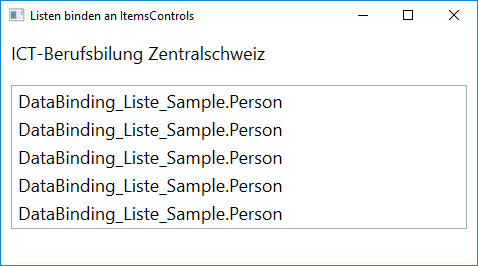

# Eine Liste binden 

Oft werden nicht einzelne Objekte gebunden, sondern Datenquellen, die mehrere Elemente enthalten wie z.B. Listen. Hier kommen die ItemsControls ins Spiel. Das sind UI-Elemente, die von der Basisklasse `ItemsControl` abgeleitet sind. Die WPF hat einige davon zu bieten: 

* `ComboBox`
* `ListBox`
* `ListView` 
* `DataGrid`
* `Menu`
* etc.

Diese Controls können mit der Eigenschaft _DataContext_ oder alternativ mit der Eigenschaft _ItemsSource_ an eine Datenquelle gebunden werden. 

Wie das Binden von Listen funktioniert, wird anhand einer Klasse `Firma` gezeigt, die über eine entsprechende Eigenschaft Zugriff auf eine Liste von Mitarbeitern bietet. 

```CSharp 
class Firma
{
    public string Name { get; set; }
    public List<Person> Mitarbeiter { get; set; }
} 
```
Zunächst werden ein paar Beispieldaten erzeugt. Dazu wird eine Firma inkl. Mitarbeiter instanziiert. Die erzeugte Instanz wird der _DataContext_-Eigenschaft des Window zugewiesen. 

```CSharp
public partial class MainWindow : Window
{
    Firma firma = new Firma
    {
        Name = "ICT-Berufsbilung Zentralschweiz", Mitarbeiter = new List<Person>
        {
            new Person { Name="Roger Erni", Wohnort="Kriens", Alter=45 },
            new Person { Name="Horst Lang", Wohnort="Geuensee", Alter=48 },
            new Person { Name="Julia Stadelmann", Wohnort="Luzern", Alter=24 },
            new Person { Name="Kurt Fischer", Wohnort="Kriens", Alter=65 },
            new Person { Name="Urs Nussbaumer", Wohnort="Ebikon", Alter=47 }
        }
    };

    public MainWindow()
    {
        InitializeComponent();
        this.DataContext = firma;
    }
}
```

Im XAML-Code wird einerseits der Name der Firma an einen TextBlock gebunden und andererseits wird die Mitarbeiter-Liste an die _ItemsSource_-Eigenschaft einer ListBox gebunden.

```XML
<StackPanel Orientation="Vertical">
    <TextBlock  Text="{Binding Path=Name}" Margin="10" />
    <ListBox ItemsSource="{Binding Path=Mitarbeiter}" />
</StackPanel>
```

Jedoch zeigt die ListBox nicht das an, was wir gerne möchten. Wie der folgende Screen-Print zeigt, werden nicht die Informationen zu den Mitarbeiter ausgegeben, sondern der Text, den die _ToString()_ Methode der Klasse `Person` zurückgibt. 



Was tun? Eine naheliegende Möglichkeit wäre, die _ToString()_ Methode zu überschreiben, sodass sie den Namen des Mitarbeiters zurückgibt. Schöner wäre jedoch, wenn der ListBox mit XAML-Code klar gemacht werden könnte, welche Informationen sie anzeigen muss. Denn Logik, die sich um die **Darstellung** von Daten kümmert, gehört nicht in eine Model-Klasse, sondern in die View, also in den XAML-Code. Bühne frei darum für die _DataTemplates_.

## DataTemplates  

Mit einem `DataTemplate` kann die visuelle Darstellung von Listen-Elementen gestaltet werden. 

Jedes `ItemsControl` und damit auch die `ListBox` hat eine Eigenschaft _ItemTemplate_, die selber vom Typ `DataTemplate` ist und für die visuelle Gestaltung der Listenelemente verwendet wird.

Die Namen der Mitarbeiter sollen in einem `TextBlock` ausgegeben werden:  

```XML
<StackPanel Orientation="Vertical">
    <TextBlock  Text="{Binding Path=Name}" />
    <ListBox ItemsSource="{Binding Path=Mitarbeiter}">
        <ListBox.ItemTemplate>
            <DataTemplate>
                <TextBlock Text="{Binding Path=Name}" />
            </DataTemplate>
        </ListBox.ItemTemplate>
    </ListBox>
</StackPanel>
```

Beachte, dass der aktuelle _DataContext_ für das `DataTemplate` nicht das `Firma`-Objekt ist. Da das Template zur Laufzeit auf jedes einzelne Element der an die _ItemsSource_-Eigenschaft der ListBox gebundenen Liste angewendet wird, ist der _DataContext_ ein `Person`-Objekt.

Die Namen der Mitarbeiter werden nun angezeigt. 


Weil sich das `DataTemplate` ähnlich verhält wie ein Content-Control und nur ein Kind-Element zulässt, benötigen wir einen Layout-Container, Um zusätzlich Wohnort und Alter auszugeben.  An dieser Stelle wird dazu ein `Grid` verwendet, wobei die erste und zweite Spalte je 3/7 der verfügbaren Breite einnehmen sollen ( `Width="3*"` ) und die dritte Spalte 1/7.

```XML
<ListBox ItemsSource="{Binding Path=Mitarbeiter}" Name="myListBox">
    <ListBox.ItemTemplate>
        <DataTemplate>
            <Grid Background="Aquamarine">
                <Grid.ColumnDefinitions>
                    <ColumnDefinition Width="3*" />
                    <ColumnDefinition Width="3*" />
                    <ColumnDefinition />
                </Grid.ColumnDefinitions>
                <TextBlock Text="{Binding Path=Name}" Grid.Column="0" />
                <TextBlock Text="{Binding Path=Wohnort}" Grid.Column="1" />
                <TextBlock Text="{Binding Path=Alter}" Grid.Column="2" />
            </Grid>
        </DataTemplate>
    </ListBox.ItemTemplate>
</ListBox>
```

Leider will das mit den Spaltenbreiten nicht so recht funktionieren! Wenn wir das Grid einfärben, sehen wir weshalb. 


Es gibt nicht nur ein Grid, sondern deren fünf. Für jedes Element in der Mitarbeiter-Liste eines. Und jedes Grid erstreckt sich **nicht** über den ganzen verfügbaren Platz, sondern passt sich in der Breite dem Inhalt seiner drei Spalten an. 

## Styles

Damit die relativen Angaben für die Spaltenbreiten greifen, müssten sich die Grids über die ganze verfügbare Breite erstrecken. Um dies zu erreichen, kann den ListBoxItems ein `Style` verpasst werden. Dieser wird der _ItemContainerStyle_-Eigenschaft der ListBox zugewiesen. 

Über die _TargetType_-Eigenschaft der Klasse `Style` lässt sich der Ziel-Typ definieren, d.h. welches Objekt gestylt werden soll. Und das `<Setter>`-Element erlaubt es, eine beliebige Eigenschaft am Ziel-Objekt zu setzen. 

```XML 
<ListBox ItemsSource="{Binding Path=Mitarbeiter}" Margin="10" Name="myListBox">
    <ListBox.ItemContainerStyle>
        <Style TargetType="ListBoxItem">
            <Setter Property="HorizontalContentAlignment" Value="Stretch" />
        </Style>
    </ListBox.ItemContainerStyle>
    <ListBox.ItemTemplate>
        <DataTemplate>
        [...]
        </DataTemplate>
    </ListBox.ItemTeemplate>
</ListBox>
```

Da nun die Eigenschaft _HorizontalContentAlignment_ eines jeden ListBoxItems auf den Wert "Stretch" eingestellt ist,  werden die Grids auf die ganze verfügbare Breite gestreckt und die relativen Angaben für die Spaltenbreiten greifen wie gewünscht. 


## Demo-Applikation 

Visual Studio Solution mit einer Implementation des oben diskutierten Beispiels.

* Download: [Liste-binden_Sample.zip](res/Liste-binden_Sample.zip) 
