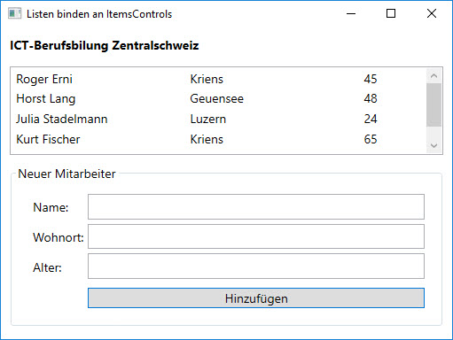

# ObservableCollection

Datenbindung ist ein sehr wichtiges Konzept der WPF und kann perfekt durch das einfache Interface `INotifyPropertyChanged` erreicht werden. Bei Klassen, die dieses Interface implementieren, aktualisieren sich Oberflächenelemente automatisch, sobald sich Werte in den gebundenen Objekten ändern. 

Um diese Technik auch für Listen zu nutzen, wird eine spezielle Collection benötigt: die `ObservableCollection<T>`.

## Hinzufügen und Löschen von Listen-Elementen 

Im vorherigen Kapitel ([Listen binden](../07%20Listen%20binden)) wurden die  Mitarbeiter einer Firma an eine ListBox gebunden. Die Mitarbeiter vom Typ `Person` wurden dabei in einer Liste gespeichert. 

```CSharp 
public List<Person> Mitarbeiter { get; set; }
```

 Dies hat soweit gut funktioniert: die Mitarbeiter wurden in der ListBox angezeigt. 
 
 Üblicherweise werden in einer Anwendung die Daten jedoch nicht nur angezeigt, sondern der Benutzer will z.B. Mitarbeiter hinzufügen oder löschen. Damit das Data Binding  solche Änderungen am Listen-Inhalt mitbekommt, muss die Liste das Interface `INotifyCollectionChanged` implementieren. Mit der generischen Collection-Klasse `ObservableCollection<T>` im Namespace _System.Collections.ObjectModel_ enthält die WPF eine Klasse, welche dieses Interface implementiert. 
 
 Damit GUI-Elemente, die an eine Liste gebunden sind, das Hinzufügen und das Löschen von Elementen mitkriegen, muss anstelle einer `List<T>` die `ObservableCollection<T>` (oder eine Ableitung davon) verwendet werden. 

```CSharp 
public ObservableCollection<Person> Mitarbeiter { get; set; }
```

Sobald Elemente hinzugefügt oder entfernt werden, feuert die ObservableCollection das _CollectionChanged_-Event und benachrichtigt so die gebundenen GUI-Elemente. So kann z.B. ein Delete-Button direkt und einfach auf die Collection zugreifen und das Element entfernen. Das Benachrichtigen und Aktualisieren der View erledigt die Collection respektive das Binding dann automatisch. 

## Demo-Applikation 

Die Demo-Applikation bindet eine ObservableCollection an eine ListBox. Wird ein neuer Mitarbeiter zur Collection hinzugefügt, aktualisiert das Data Binding die ListBox automatisch.




* Download: [ObservableCollection_Sample.zip](res/ObservableCollection_Sample.zip) 