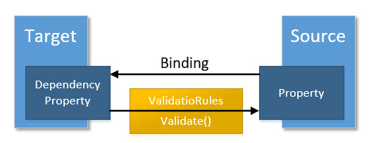
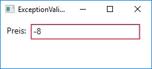

# ValidationRules

Um die vom Benutzer eingegebenen Daten zu validieren, besitzt das Binding-Objekt eine _ValidationRules_-Property. Die in dieser Eigenschaft festgelegten Regeln kommen dann zur Anwendung, wenn ein Wert vom Target des Bindings in die Source geschrieben wird. Das heisst also, dass ValidationRules nur dann zur Anwendung kommen können, wenn der Binding-Mode entweder auf _TwoWay_ oder auf _OneWayToSource_ gesetzt wurde. Die folgende Abbildung verdeutlicht dies. 



Der _ValidationRules_-Eigenschaft werden Instanzen vom Typ `ValidationRule` zugewiesen. Die `ValidationRule`-Klasse selbst ist eine abstrakte Klasse und enthält die abstrakte Methode _Validate()_, die von den Subklassen zum Validieren überschrieben wird. Die WPF besitzt bereits zwei Klassen, die von `ValidationRule` abgeleitet sind: `ExceptionValidationRule` und `DataErrorValidationRule`. 

## Validieren mit der WPF-Klasse `ExceptionValidationRule` 

Die von der WPF zur Verfügung gestellte `ExceptionValidationRule`-Klasse überprüft, ob bei Änderung der Source-Eigenschaft des Bindings Exceptions geworfen werden. 

Im folgenden Beispiel wurde eine TextBox an die Eigenschaft _Preis_ der Klasse `Auto` gebunden. Das Binding hat als Update-Source-Trigger den Wert `PropertyChanged` spezifiziert, damit die Source-Property (Preis) unmittelbar bei Benutzereingabe aktualisiert wird. Die Validierung des Preises schliesslich soll  mit der `ExceptionValidationRule` erfolgen.

```XML
<Window ...>
<Window.DataContext>
    <local:Auto Preis="8"/>
</Window.DataContext>
<Grid Margin="5">
    ...
    <TextBox>
        <TextBox.Text>
            <Binding Path="Preis" UpdateSourceTrigger="PropertyChanged">
                    <Binding.ValidationRules>
                        <ExceptionValidationRule />
                    </Binding.ValidationRules>
            </Binding>
        </TextBox.Text>
    </TextBox>
    ...
</Grid>
```

Damit die `ExceptionValidationRule` ihren Dienst tun kann, muss die _Preis_-Property der Klasse `Auto` eine `Exception` werfen, falls der Wert kleiner 0 ist. 

```CSharp
public class Auto : INotifyPropertyChanged
{   
    decimal _preis;
    public decimal Preis
    {
        get { return _preis;}
        set
        {
            if (value < 0) 
                throw new ArgumentOutOfRangeException("Preis darf nicht negativ sein!");
           
            _preis = value;
            OnPropertyChanged("Preis");
        }
    }
    ...
}
```

Gibt der Benutzer nun zur Laufzeit einen negativen Preis ein, wird WPF um die TextBox ein rotes Rechteck zeichnen und macht so auf den Fehler aufmerksam. Die _Preis_-Property vom `Auto`-Objekt nimmt dabei den negativen Wert erst gar nicht an. 


 
### Demo-Applikation 

Visual Studio Solution mit einer Implementation des gerade diskutierten Beispiels.

* Download: [ExceptionValidationRule_Sample.zip](res/ExceptionValidationRule_Sample.zip) 

## Validieren mit einer eigenen ValidationRule 

Um eine benutzerspezifische Validierungsregel zu implementieren, kann eine eigene Klasse erstellt werden, die von `ValudationRule` erbt und die _Validate_-Methode überschreibt, welche als ersten Paramater den zu prüfenden Wert erhält und ein Objekt vom Typ `ValidationResult` zurückgibt. 

Das folgenden Beispiel prüft die _Validate_-Methode in der Klasse `PreisvalidationRule`, ob der eingegebene Wert kleiner als 0 ist.  

```CSharp
public class PreisValidationRule : ValidationRule
{
    public override ValidationResult Validate(object value, CultureInfo cultureInfo)
    {
        decimal val;
        if (decimal.TryParse(value.ToString(), out val))
        {
            if (val < 0)
                return new ValidationResult(false, "Preis darf nicht negativ sein!");
        }
        return ValidationResult.ValidResult;
    }
}
```
Falls der Wert ungültig ist, wird eine `ValidationResult`-Instanz zurückgegeben, die über den ersten Parameter des Konstruktors als ungültig gekennzeichnet wird (im zweiten Parameter wird die Fehlermeldung mitgegeben).  

Falls der Wert grösser oder gleich 0 ist, wird eine gültige `ValidationResult`-Instanz zurückgegegeben, die wir von der statischen Property _ValidResult_ erhalten (so können wir uns den Konstruktor mit einer leeren Fehlermeldung sparen).

Natürlich könnten in der _Validate_-Methode beliebig weitere Prüfungen vorgenommen werden, z.B. könnte auch dann ein ungültiges `ValidationResult` zurückgegeben werden, wenn die _decimal.TryParse()_-Methode _false_ liefert.

Jetzt muss lediglich noch in XAML eine Instanz der Klasse `PreisValidationRule` zur _ValidationRules_-Property des Binding-Objekts hinzugefügt werden.  

```XML
<TextBox>
    <TextBox.Text>
        <Binding Path="Preis" UpdateSourceTrigger="PropertyChanged" >
            <Binding.ValidationRules>
                <local:PreisValidationRule />
            </Binding.ValidationRules>
        </Binding>
    </TextBox.Text>
</TextBox>
```

**Hinweis:** Bei der eigenen `ValidationRule` musste die `Auto`-Klasse nicht angepasst werden. Diese Möglichkeit ist somit immer dann die richtige Wahl, wenn man keinen Zugriff auf die gebundende Datenklasse hat! 