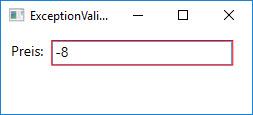
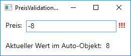

# Benutzerspezifisches visuelles Feedback bereitstellen

Wenn der Benutzer einen ungültigen Wert eingibt, kann es sinnvoll sein, ihm auf UI-Seite ein Feedback zum Fehler zu geben. Dabei kann das Feedback in Form einer Fehlermeldung gegeben werden oder aber visuell. In diesem Kapitel wird gezeigt, wie der _ErrorTemplate_-Property der Klasse `Validation` ein _ControlTemplate_ zugewiesen wird und so ein benutzerspezifisches visuelles Feedback gestaltet werden kann. 
 
## Die Klasse `Validation`

Im vorheringen Kapitel haben wir gesehen, dass eine Textbox einen roten Rahmen erhält, wenn die Validierung der Eingabe einen ungültigen Wert erkennt. 



Für die Anzeige dieses roten Rahmens nutzt die Textbox Attached Properties der statischen Klasse `Validation`, wovon die folgenden drei auf dem Target-Element eines Data Bindings zur Verfügung stehen: 

* **Errors:** Enthält die beim Validieren ermittelten ValidationError-Objekte.  
* **HasError:** Gibt _true_ zurück, falls nur eines der auf dem Target-Element definierten _Binding_-Objekte einen Fehler zurückgibt.
* **ErrorTemplate:** Definiert das _ControlTemplate_, das bei Fehlern angezeigt wird; bei einer Textbox ist das standardmässig ein roter Rahmen.

## Ein ErrorTemplate festlegen 

Wenn wir den standardmässigen roten Rahmen, der bei Validierungsfehlern um die Textbox gezeichnet wird, mit einem benutzerspezifischen visuellen Feedback ersetzen möchten, müssen wir der Attached Property _Validation.ErrorTemplate_ ein `ControlTemplate` zuweisen. Und innerhalb des ControlTemplates muss ein `AdornedElementPlaceholder` eingefügt werden. Dies ist der Platzhalter, an dessen Stelle später die Textbox eingefügt wird, wenn das ControlTemplate zur Anwendung kommt. 

Im folgenden Beispiel befindet sich der `AdornedElementPlaceholder` Platzhalter in einem horizontalen Stackpanel, zusammen mit einem TextBlock-Element. 

```XML
<TextBox>
    <Validation.ErrorTemplate>
        <ControlTemplate>
            <StackPanel Orientation="Horizontal">
                <AdornedElementPlaceholder />
                <TextBlock Text=" !!!" Foreground="Red" FontWeight="Bold" />
            </StackPanel>
        </ControlTemplate>
    </Validation.ErrorTemplate>
    ...
</TextBox>
```

Das TextBlock-Element mit den drei Ausrufezeichen wird nun bei einem Validierungsfehler hinter der TextBox angezeigt. 



Du möchtest zusätzlich zu den drei Ausrufezeichen den roten Rahmen um die Textbox wieder haben? Kein Problem: Umfasse den AdornedElementPlaceholder mit einem _Border_-Element.  

```XML
<TextBox>
    ...
    <Border BorderThickness="1" BorderBrush="Red">
        <AdornedElementPlaceholder />
    </Border>
    <TextBlock Text=" !!!" Foreground="Red" FontWeight="Bold" />
    ...
</TextBox>
```

### ErrorTemplate in einen Style auslagern 

Momentan wird das _ErrorTemplate_ "nur" auf die eine einzige, konkrete Textbox angewandt. Soll es auf alle Textboxen innerhalb eines Window angewandt werden, muss ein [Style](../../02%20XAML/05%20Styles/README.md) definiert werden. 

```XML
    <Window.Resources>
       <Style TargetType="TextBox">
            <Setter Property="Validation.ErrorTemplate">
                <Setter.Value>
                    <ControlTemplate>
                        <StackPanel Orientation="Horizontal">
                            <Border BorderThickness="1" BorderBrush="Red">
                                <AdornedElementPlaceholder />
                            </Border>
                            <TextBlock Text=" !!!"  Foreground="Red" FontWeight="Bold" />
                        </StackPanel>
                    </ControlTemplate>
                </Setter.Value>
            </Setter>
        </Style>    
    </Window.Resources>
``` 

Wird die _TargetType_-Property des Styles auf _TextBox_ gesetzt, gilt der Style für alle TextBox-Objekte innerhalb des Window.

## Demo-Applikation 

Eine Visual Studio Solution mit einer kompletten Implementation mit dem in diesem Kapitel diskutierten Beispiel. Zusätzlich mit einem Beispiel, wie Fehlermeldungen in einem ToolTip visualisert werden. 

* Download: [Validation.ErrorTemplate_Sample.zip](res/Validation.ErrorTemplate_Sample.zip) 
