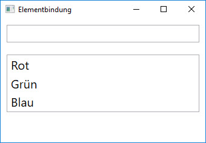
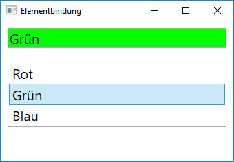

# UI-Elemente binden 

## Aufgabe 

Erstelle deine erste Elementbindung.

### Schritt 1

Erstelle eine WPF-Anwendung mit einem Fenster, auf dem du eine `TextBox` und eine `ListBox` platzierst. Die ListBox soll drei Items enthalten, die du direkt in XAML notierst (`ListBoxItem`), mit dem Content "Rot", "Grün", "Blau", sodass sich folgende Benutzerobefläche ergibt.



### Schritt 2 

Erstelle im XAML-Code ein Binding für die _Text_-Property der TextBox, welches dafür sorgt, dass die in der ListBox ausgewählte Farbe sofort in der TextBox angezeigt wird. Dazu wird als Datenquelle des Bindings der _Content_ des jeweils gerade ausgewählten Items der ListBox benötigt. 

```xml 
<TextBox Text="{Binding ElementName=myListBox, Path=SelectedItem.Content}" />
```

## Zusatzaufgabe

Zusätzlich zum Text "Rot", "Grün" oder "Blau" soll auch der Hintergrund (_Background_) der TextBox entsprechend gefärbt werden. 
 
