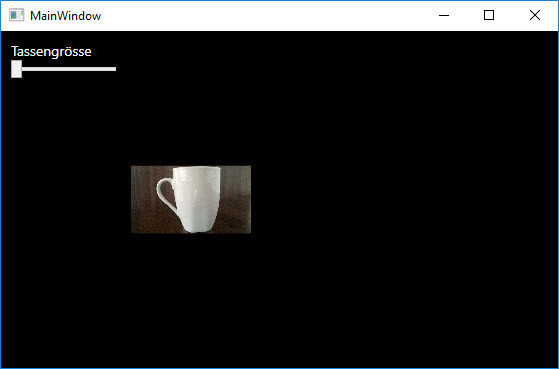
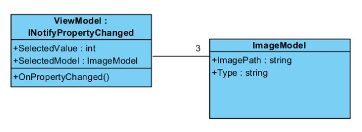
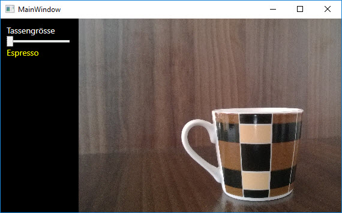

# Die Grösse der Kaffeetasse bestimmen

## Aufgabe 

Erstelle eine Anwendung, mit der ein Kaffeetrinker die Tassengrösse für seinen Kaffee bestimmen kann. Mit einer Datenbindung soll dafür gesorgt werden, dass sich die Grösse der Kaffeetasse dem gewählten Slider-Wert entsprechend anpasst.

### Schritt 1

Erstelle mit XAML eine Oberfläche, die wie folgt aussieht. 



Die Bilder, die du für die Aufgabe benötigst, findest du hier: 

* [Kleine Tasse](res/small.jpg)
* [Mittelgrosse Tasse](res/medium.jpg)
* [Grosse Tasse](res/big.jpg)


### Schritt 2 

Mit dem Slider soll die Tassengrösse verändert werden können. Wenn der Slider nach rechts bewegt wird, soll die Tasse (das Bild) grösser werden. Binde dazu die Elemente und Eigenschaften direkt aneinander (Elementbindung). 

**Hinweis**: Der Slider hat eine  _Maximum_- und _Minimum_-Eigenschaft sowie eine _Value_-Eigenschaft, die den aktuellen Slider-Wert angibt. 

### Schritt 3 

Espresso-Trinker werden keine Freude an unserer Lösung haben, denn eine Espresso-Tasse sieht anders aus. Mit dem Slider soll darum nicht einfach eine Kaffee-Tasse vergrössert und verkleinert werden, sondern der Slider soll **verschiedene Bilder anzeigen**, je nach Kaffeetassengrösse. Und zusätzlich soll ein Textfeld den Typ des Kaffees anzeigen: Espresso (Kleine Tassse), Kaffee (Mittelgrosse Tasse), Latte Macchiato (Grosse Tasse). 

#### Model-Klasse erstellen

Füge zum Projekt eine neue Klasse `ImageModel` hinzu. Die Klasse hat zwei Eigenschaften: _ImagePath_ und _Type_, der Pfad zum Kaffeetassen-Bild und der Typ des Kaffees zur Anzeige im Textfeld. 

```CSharp 
public class ImageModel
{   
    public string ImagePath { get; set; }
    public string Type { get; set; }
}
```

#### ViewModel: Eine Klasse für den DataContext erstellen

Als nächstes benötigen wir eine Klasse, die wir als _DataContext_ für das MainWindow (die View) verwenden können. Füge also zum Projekt nochmals einen neue Klasse hinzu und benenne sie mit `ViewModel`. Programmiere die Klasse so, dass sie...

* ...`INotifyPropertyChanged`  implementiert.
* ...eine Liste bereit stellt, um die 3 benötigten ImageModels zu speichern.
    ```CSharp
    List<ImageModel> _imageModels;
    ```
* ...eine öffentliche Eigenschaft _SelectedValue_ vom Typ `int` besitzt, die an die _Value_-Eigenschaft des Sliders gebunden werden kann.
* ...eine öffentliche Eigenschaft `SelectedModel` vom Typ `ImageModel` hat, um den _ImagePath_ und den _Typ_ des aktuell durch den Slider selektierten Models an die _Source_-Eigenschaft des Images respektive an die _Text_-Eigenschaft des Textfeldes binden zu können. 

    ```CSharp
    public ImageModel SelectedModel
    {
        get { return _imageModels[SelectedValue]; }
    }
    ```

#### Klassendiagramm

Das Klassendiagramm zeigt die Struktur der beiden zu erstellenden Klassen, sowie deren Beziehung zu einander. 



### Schritt 4 

Verknüpfe das ViewModel mit der View indem du zunächst den _DataContext_ deines Windows auf eine neue Instanz des ViewModels setzst und danach das DataBinding im XAML-Code einrichtest. 

Binde dazu die _Value_-Eigenschaft des Sliders an die _SelectedValue_-Eigenschaft des ViewModels, die _Source_-Eigenschaft des Images an die _ImagePath_-Eigenschaft des aktuell selektierten ImageModels und die _Text_-Eigenschaft des Textfeldes an die _Typ_-Eigenschaft des aktuell selektierten ImageModels. 

### Die fertige Anwendung  

Hier ein Bild der fertigen Anwendung. Es zeigt die Auswahl der kleinsten Tasse. 




