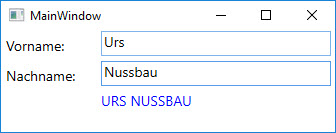
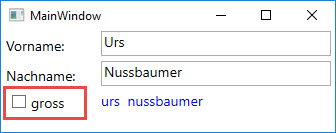

# Aus Klein mach Gross und zurück

## Aufgabe 

Erstelle eine WPF-Anwendung mit zwei Eingabefeldern, in die der Vorname respektive der Nachname einer Person eingegeben werden können. 

Platziere unterhalb der beiden  Eingabefelder ein _TextBlock_- oder ein _Label_-Element und sorge dafür, dass dort der volle Name der Person in GROSSSCHRIFT ausgegeben wird und zwar "live", d.h.  schon während der Benutzer die Namen eintippt.   

Orientiere dich bei der Umsetzung der Aufgabe an der folgenden Todo-Liste. 

- [ ] Das GUI (MainWindow) mit XAML erstellen/designen.
- [ ] Eine Klasse `Person` erstellen, die als Eigenschaften _FirstName_, _LastName_, _FullName_ besitzt und die `INotifyPropertyChanged` implementiert.
- [ ] Den _DataContext_ des MainWindow setzen.
- [ ] Das Data Binding für die Eingabefelder einrichten. 
- [ ] Über die _UpdateSourceTrigger_-Eigenschaft steuern, dass der volle Name der Person "live", d.h. während der Benutzer Vor- und Nachname eintippt, aktualisiert wird. 
- [ ] Eine Konverter-Klasse namens `UpperCaseConverter` erstellen; sie muss das Interface `IValueConverter` implementieren und soll dazu  verwendet werden, einen Text in Grossbuchstaben umzuwandeln.
- [ ] Die Konverter-Klasse im MainWindow als Ressource einbinden.
- [ ] Die Konverter-Klasse gemäss Aufgabenstellung verwenden.

## Zusatzaufgabe

Erweitere die Anwendung mit einer `CheckBox`, die du mit "gross" beschriftest. Der volle Name soll neu nur dann mit GROSSBUCHSTABEN ausgegeben werden, wenn die CheckBox aktiviert ist. Ist die CheckBox hingegen nicht aktiviert, soll der Name in kleinbuchstaben ausgegeben werden. 

