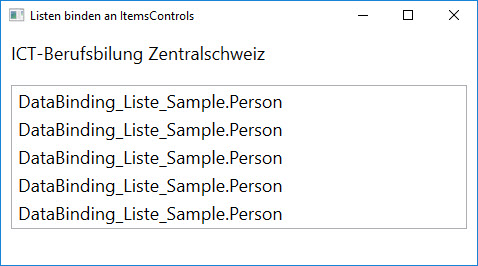
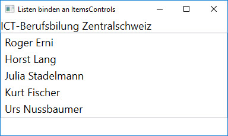
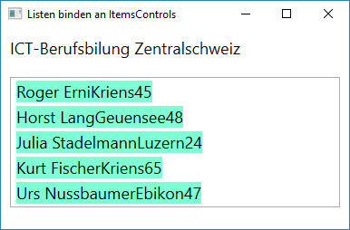
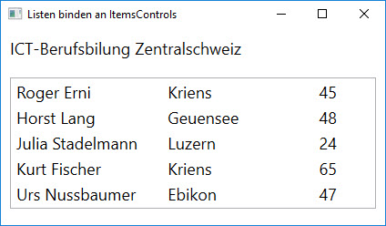

# Eine Liste binden 

Oft werden nicht einzelne Objekte gebunden, sondern Datenquellen, die mehrere Elemente enthalten wie z.B. Listen. Hier kommen die WPF-ItemsControls ins Spiel. Das sind UI-Elemente, die von der Basisklasse `ItemsControl` abgeleitet sind. Die WPF hat einige davon zu bieten: 

* `ComboBox`
* `ListBox`
* `ListView` 
* `DataGrid`
* `Menu`
* etc.

Diese Controls können mit der Eigenschaft _DataContext_ oder alternativ mit der Eigenschaft _ItemsSource_ an eine Datenquelle gebunden werden. 

Wie das Binden von Listen funktioniert, wird anhand der folgenden Klasse `Firma` an, die über eine entsprechende Eigenschaft Zugriff auf eine Liste von Mitarbeitern bietet. 

```CSharp 
class Firma
{
    public string Name { get; set; }
    public List<Person> Mitarbeiter { get; set; }
} 
```
Zunächst werden ein paar Beispieldaten erzeugt. Dazu wird eine Firma inkl. Mitarbeiter instanziiert. Die erzeugte Instanz wird der _DataContext_-Eigenschaft des Window zugewiesen. 

```CSharp
public partial class MainWindow : Window
{
    Firma firma = new Firma
    {
        Name = "ICT-Berufsbilung Zentralschweiz", Mitarbeiter = new List<Person>
        {
            new Person { Name="Roger Erni", Wohnort="Kriens", Alter=45 },
            new Person { Name="Horst Lang", Wohnort="Geuensee", Alter=48 },
            new Person { Name="Julia Stadelmann", Wohnort="Luzern", Alter=24 },
            new Person { Name="Kurt Fischer", Wohnort="Kriens", Alter=65 },
            new Person { Name="Urs Nussbaumer", Wohnort="Ebikon", Alter=47 }
        }
    };

    public MainWindow()
    {
        InitializeComponent();
        this.DataContext = firma;
    }
}
```

Im XAML-Code wird einerseits der Name der Firma an einen TextBlock gebunden und andererseits wird die Mitarbeiter-Liste an die _ItemsSource_-Eigenschaft einer ListBox gebunden.

```XML
<StackPanel Orientation="Vertical">
    <TextBlock  Text="{Binding Path=Name}" Margin="10" />
    <ListBox ItemsSource="{Binding Path=Mitarbeiter}" />
</StackPanel>
```

Jedoch zeigt die ListBox noch nicht das an, was wir gerne möchten. Wie der folgende Screen-Print zeigt, werden nicht die Informationen zu den Mitarbeiter ausgegeben, sondern der Text, den die _ToString()_ Methode der Klasse `Person` zurückgibt. 



Was tun? Eine naheliegende Möglichkeit wäre, die _ToString()_ Methode zu überschreiben, sodass sie den Namen des Mitarbeiters zurückgibt. Schöner wäre jedoch, wenn der ListBox mit XAML-Code klar gemacht werden könnte, welche Informationen sie anzeigen muss; denn Logik, die sich um die **Darstellung** von Daten kümmert, gehört nicht in eine Model-Klasse, sondern in die View, also in den XAML-Code. Bühne frei darum für die _DataTemplates_.

## DataTemplates  

Mit einem `DataTemplate` kann die visuelle Darstellung von Listen-Elementen gestaltet werden. 

Jedes `ItemsControl` und damit auch die `ListBox` hat eine Eigenschaft _ItemTemplate_, die selber vom Typ `DataTemplate` ist und für die visuelle Gestaltung der Listenelemente verwendet wird.

Die Namen der Mitarbeiter sollen in einem `TextBlock` ausgegeben werden:  

```XML
<StackPanel Orientation="Vertical">
    <TextBlock  Text="{Binding Path=Name}" />
    <ListBox ItemsSource="{Binding Path=Mitarbeiter}">
        <ListBox.ItemTemplate>
            <DataTemplate>
                <TextBlock Text="{Binding Path=Name}" />
            </DataTemplate>
        </ListBox.ItemTemplate>
    </ListBox>
</StackPanel>
```

Beachte, dass der aktuelle _DataContext_ für das `DataTemplate` nicht das `Firma`-Objekt ist. Da das Template zur Laufzeit auf jedes einzelne Element der an die _ItemsSource_-Eigenschaft der ListBox gebundenen Liste angewendet wird, ist der _DataContext_ ein `Person`-Objekt.

Die Namen der Mitarbeiter werden nun angezeigt. 



Weil sich das `DataTemplate` ähnlich verhält wie ein Content-Control und nur ein Kind-Element zulässt, benötigen wir einen Layout-Container, Um zusätzlich Wohnort und Alter auszugeben. 

Es wird ein `Grid` verwendet, wobei die erste und zweite Spalte je 3/7 der verfügbaren Breite einnehmen sollen ( `Width="3*"` ) und die dritte Spalte 1/7.

```XML
<ListBox ItemsSource="{Binding Path=Mitarbeiter}" Name="myListBox">
    <ListBox.ItemTemplate>
        <DataTemplate>
            <Grid Background="Aquamarine">
                <Grid.ColumnDefinitions>
                    <ColumnDefinition Width="3*" />
                    <ColumnDefinition Width="3*" />
                    <ColumnDefinition />
                </Grid.ColumnDefinitions>
                <TextBlock Text="{Binding Path=Name}" Grid.Column="0" />
                <TextBlock Text="{Binding Path=Wohnort}" Grid.Column="1" />
                <TextBlock Text="{Binding Path=Alter}" Grid.Column="2" />
            </Grid>
        </DataTemplate>
    </ListBox.ItemTemplate>
</ListBox>
```

Leider will das mit den Spaltenbreiten nicht so recht funktionieren. Wenn wir das Grid einfärben, sehen wir weshalb. 



Es gibt nicht nur ein Grid, sondern deren 5: für jedes Elemente in der Mitarbeiter-Liste eines. Und jedes Grid erstreckt sich **nicht** nun mal nicht über den ganzen verfügbaren Platz, sondern passt sich in der Breite dem Inhalt seiner drei Spalten an. 

## Styles

Damit die relativen Angaben für die Spaltenbreiten greifen, müssten sich die Grids über die ganze verfügbare Breite erstrecken. Um dies zu erreichen, kann den ListBoxItems ein `Style` verpasst werden. Dieser wird der _ItemContainerStyle_-Eigenschaft der ListBox zugewiesen. 

Über die _TargetType_-Eigenschaft der Klasse `Style` lässt sich der Ziel-Typ definieren, d.h. welches Objekt gestylt werden soll. Und das `<Setter>`-Element erlaubt es, eine beliebige Eigenschaft am Ziel-Objekt zu setzen. 

```XML 
<ListBox ItemsSource="{Binding Path=Mitarbeiter}" Margin="10" Name="myListBox">
    <ListBox.ItemContainerStyle>
        <Style TargetType="ListBoxItem">
            <Setter Property="HorizontalContentAlignment" Value="Stretch" />
        </Style>
    </ListBox.ItemContainerStyle>
    <ListBox.ItemTemplate>
        <DataTemplate>
        [...]
        </DataTemplate>
    </ListBox.ItemTeemplate>
</ListBox>
```

Da nun die Eigenschaft _HorizontalContentAlignment_ eines jeden ListBoxItems auf den Wert "Stretch" eingestellt ist,  werden die Grids auf die ganze verfügbare Breite gestreckt und die relativen Angaben für die Spaltenbreiten greifen wie gewünscht. 

