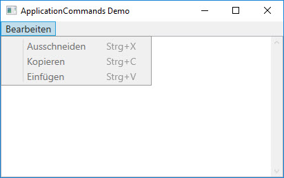

# Commands 

Wir haben gesehen, dass mit [DataBinding](../03%20DataBinding/README.md) die Trennung der Oberflächenbeschreibung (XAML) von der Programmlogik (C#) möglich wird. Mit _Commands_ kann diese Trennung auf ein noch höheres Niveau gebracht werden; denn sie ermöglichen das Schreiben von Programmlogik so, dass alle wesentlichen Operationen vollkommen unabhängig von der Oberfläche werden. Im Idealfall kann die Oberfläche dann sogar ausgetauscht werden. 

Konsequent umgesetzt wird dieses Prinzip mit einem Konzept, das als Model View ViewModel (MVVM) bekannt ist, auf das an dieser Stelle nicht eingegangen wird. Doch auch für  Entwickler, die nicht die absolute Trennung zwischen Oberfläche (View) und  Programmlogik (ViewModel, Model) verfolgen, bietet das Command-Konzept genügend Anreize, um es zu nutzen. 

## Allgemeine Beschreibung

Dass Konzept der Commands ist im ersten Moment etwas komplex. Daher zuerst einmal einen Überblick über die an diesem Konzept Beteiligten:

* **Command:** Ein Kommando beschreibt eine bestimmte Aufgabe. Dabei wird verfolgt, ob der Command ausgeführt werden kann oder nicht. Wie wir noch sehen werden, beinhalten Commands nicht die Anwendungslogik. 
* **Command-Quelle:** Mit der Quelle ist die Komponente gemeint, die einen Command anstösst. Das kann ein _Button_ oder ein beinahe beliebiges anderes UI-Element sein. Allen Quellen ist gemeinsam, dass sie die Schnittstelle ``ICommandSource` implementieren.  
* **Command-Ziel:** Damit ist das Element gemeint, auf dem das Kommando ausgeführt wird. 
* **Command-Bindung:** Die Bindung sorgt für die Verknüpfung eines Commands mit der Anwendungslogik. 
 
## Vordefinierte WPF-Commands

WPF stellt eine Reihe vordefinierter Command-Objekte bereit, mit denen Anwendungsprogrammierer häufig arbeiten. Sie lassen sich in fünf Kategorien unterteilen. Jede Kategorie wird durch eine der folgenden Klassen beschrieben:

* `ApplicationCommands` (im Namespace: _System.Windows.Input_)
* `ComponentCommands` (im Namespace: _System.Windows.Input_) 
* `EditingCommands` (im Namespace: _System.Windows.Documents) 
* `MediaCommands` (im Namespace: _System.Windows.Input_) 
* `NavigationCommands` (im Namespace: _System.Windows.Input_) 

Alle Befehle all dieser Klassen aufzulisten, würde den Rahmen dieses Dokumentes sprengen. Stattdessen sei auf die MSDN verwiesen: 

* [System.Windows.Input-Namespace](https://msdn.microsoft.com/de-de/library/system.windows.input(v=vs.110).aspx)
* [System.Windows.Documents-Namespace](https://msdn.microsoft.com/de-de/library/system.windows.documents(v=vs.110).aspx)

### Beispiel 

In diesem Beispiel wird gezeigt, wie die vordefinierten `ApplicationCommands` _Cut_, _Copy_ und _Paste_ verwendet werden. Es sei an dieser Stelle angedeutet, dass es nicht immer ganz so einfach ist, wie in diesem Beispiel gezeigt. 

Das Beispiel-Window enthält eine Menüleiste. Es gibt das Menu "Bearbeiten" mit den Befehlen "Ausschneiden", "Kopieren" und "Einfügen". Und im Arbeitsbereich des Fensters befindet sich eine Textbox. 



Hier der XAML-Code dazu: 

```XML
<DockPanel>
        <Menu DockPanel.Dock="Top" FontSize="14">
            <MenuItem Header="_Bearbeiten">
                <MenuItem Command="ApplicationCommands.Cut" Header="_Ausschneiden" />
                <MenuItem Command="ApplicationCommands.Copy" Header="_Kopieren" />
                <MenuItem Command="ApplicationCommands.Paste" Header="_Einfügen" />
            </MenuItem>
        </Menu>
        <TextBox TextWrapping="Wrap" AcceptsReturn="True" VerticalScrollBarVisibility="Visible" Text="Beispiel von hier: http://www.blackwasp.co.uk/WPFCommands_2.aspx"/>
    </DockPanel>
```

 Die Anwendung ermöglicht, den in der Textbox markierten Text in die Zwischenablage auszuschneiden respektive zu kopieren sowie den Inhalt aus der Zwischenablage in die Textbox einzufügen. Dazu muss **keinerlei C#-Code geschrieben werden**; die Anwendung arbeitet wie erwartet und das Programm ist voll funktionstüchtig. Beachte ausserdem, dass für die Menu-Elemente keine Beschriftung im XAML-Code angegeben ist. Dass die Menu-Elemente dennoch korrekt beschriftet werden, ist ebenfalls auf die Commands zurückzuführen. Die Magie wird durch die Bindung der Befehle _Cut_, _Copy_ und _Paste_ an die Menu-Elemente erreicht:  

```
Command="ApplicationCommands.Cut"
```
```
Command="ApplicationCommands.Copy"
```
```
Command="ApplicationCommands.Paste"
```

Nicht alle Steuerelemente können vordefinierte WPF-Commands registrieren. Diese Fähigkeit bleibt den Controls vorbehalten, die das Interface `ICommandSource` implementieren. Dazu gehören beispielsweise `ButtonBase`, `HyperLink` und `MenuItem` sowie jene Klassen, die von diesen Klassen abgeleitet sind.