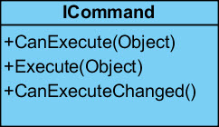

# Das Interface `ICommand`

WPF bietet zwei Optionen, um UI-Aktionen (z.B. ein Klick auf einen Button) zu behandeln: 

1. Programmierung eines Event-Handlers, der im Code-Behind der XAML-Datei erstellt und in XAML mit dem betreffenden Control verknüpft wird. Diese Möglichkeit kennen wir von "Windows Forms" und ist für kleinere WPF-Anwendungen nach wie vor  geeignet und legitim.  

    *Event-Handler in der Code-Behind Datei:* 

    ```CSharp
    private void Button_Click(object sender, RoutedEventArgs e)
    {
        MessageBox.Show("Hello World!");
    }
    ```

    *Verknüpfung des Event-Handlers mit dem Control (hier: ein Button) in XAML:*

    ```xml
    <Button Content="Klick mich" Click="Button_Click" />
    ```

2. Implementation des `ICommand`-Interfaces. Der Code respektive die Programmlogik, die nach der UI-Aktion abgearbeitet werden soll, wird in eine eigene Klasse ausgelagert, d.h. es wird kein Code-Behind geschrieben. Diese Vorgehensweise ist zwingend nötig, wenn die WPF-Anwendung gemäss dem [Model-View-ViewModel (MVVM)](../../07%20MVVM/01%20Grundlagen/README.md) Pattern entwickelt wird. 

## Implementation von `ICommand` (Beispiel)

Durch das Interface `ICommand` (Namespace: _System.Windows.Input_) wird einem `Command` vorgeschrieben, wie er zu arbeiten hat. Die Schnittstelle ist wie folgt definiert. 

 

Die Methode _Execute_ ist für die Anwendungslogik zuständig. Tatsächlich wird in _Execute_ ein komplexer Prozess angestossen, an dessen Ende erreicht wird, dass ein einziger Command von mehreren Elementen genutzt werden kann. 

_CanExecute_-Implementierungen sind weniger komplex. Die Methode gibt ganz einfach nur Auskunft darüber, ob ein Command ausgeführt werden kann. Bei Buttons z.B. verhält sich das so: Wird _true_ zurückgegeben, kann der Button gedrückt werden; liefert die Methode _CanExecute_ hingegen _false_, so ist der Button deaktiviert (disabled). 

Der Event _CanExecuteChanged_ wird ausgelöst, wenn sich der Zustand des Commands ändert und kann als Aufforderung an alle Elemente, die den Command nutzen, verstanden werden, die Methode _CanExecute_ aufzurufen. 

Eine Implementation von `ICommand` wird der View über eine eigene Klasse (typischerweise eine ViewModel-Klasse) angeboten.

*Eine Implementation von ICommand:*

```CSharp 
class ClickCommand : ICommand
{
    public event EventHandler CanExecuteChanged;

    public bool CanExecute(object parameter)
    {
        return true;
    }

    public void Execute(object parameter)
    {
        MessageBox.Show("Hallo Welt");
    }
}
```
*Der Command wird innerhalb einer ViewModel-Klasse über eine öffentliche Eigenschaft angeboten:*

```CSharp
class MyViewModel
{
    public ClickCommand ClickCmd { get; set; }

    public MyViewModel()
    {
        ClickCmd = new ClickCommand();
    }

                                        }
```

*Das Binding des vom ViewModel angebotenen Commands in der View (beachte: damit der Command gebunden werden kann, muss der DataContext des Window auf die ViewModel-Klasse gesetzt werden):*

```xml
<Window ... >
<Window.DataContext>
        <local:MyViewModel />
    </Window.DataContext>
    <Canvas>
        <Button Content="Klick mich" Command="{Binding ClickCmd}" />
    </Canvas>
</Window>
```

## Generische Implementation von `ICommand`

Für grössere WPF-Anwendungen hat sich das Entwurfsmuster [Model-View-ViewModel](../../07%20MVVM/01%20Grundlagen/README.md) bewährt. Um WPF-Anwendungen nach MVVM realisieren zu können, werden üblicherweise auf Delegates basierende Commands verwendet. 

Bei der folgenden Klasse `DelegateCommand` handelt es sich um eine  universell verwendbare Implementation der ICommand-Schnittstelle (du darfst sie gerne kopieren und in deinen Projekten verwenden). Um die gewünschte Wiederverwendbarkeit und Flexibilität für den Einsatz in MVVM-Applikationen zu erreichen, werden Delegaten benutzt.  

```CSharp
/// <summary>
/// Universell vewendbare Implementation der ICommand-Schnittstelle. 
/// </summary>
/// <typeparam name="T"></typeparam>
public class DelegateCommand<T> : ICommand
{
    // Diese beiden Delegaten werden vom Konstruktor verlangt.  
    // Sie sind Verweise auf jene Methoden, die zur Laufzeit 
    // aufgerufen werden. 
    Action<T> executeHdl { get; set; }
    Predicate<T> canExecuteHdl { get; set; }

    /// <summary>
    /// Constructor.
    /// </summary>
    /// <param name="executeHdl">Methode, welche die Implementation der Command-Logik enthält</param>
    /// <param name="canExecuteHdl">Methode, welche die Implementation der Prüf-Logik, ob die Command-Logik ausgeführt werden kann, enthält.</param>
    public DelegateCommand(Action<T> executeHdl, Predicate<T> canExecuteHdl)
    {
        this.canExecuteHdl = canExecuteHdl;

        if (executeHdl == null)
            throw new ArgumentNullException("executeHdl", "Please specifiy the command.");

        this.executeHdl = executeHdl;
    }

    public event EventHandler CanExecuteChanged
    {   
        // Wir statten diesen Event mit dem add- und dem remove-Accessor aus, 
        // damit wir uns nicht selbst um das Auslösen des Events 
        // kümmern müssen (wir können uns so auf die Logik des CommandManagers 
        // verlassen). 
        add { CommandManager.RequerySuggested += value; }
        remove { CommandManager.RequerySuggested -= value;  }
    }
    
    /// <summary>
    /// Liefert true, wenn kein externer Code hinterlegt ist (d.h. wenn der Delegat null ist) 
    /// oder wenn die externe Methode, die dieser Klasse übergeben 
    /// wurde (die über den Delegat aufgerufen wird) true zurückgibt. 
    /// </summary>
    /// <param name="parameter"></param>
    /// <returns></returns>
    public bool CanExecute(object parameter)
    {
        return canExecuteHdl == null || canExecuteHdl((T)parameter) == true;
    }

    /// <summary>
    /// Diese Methode delegiert den Aufruf an den extern implementierten Code.
    /// </summary>
    /// <param name="parameter"></param>
    public void Execute(object parameter)
    {
        executeHdl((T)parameter);
        
    }
}
```
### Demo-Applikation 

Visual Studio Solution mit einer Demo-Applikation, die MVVM implementiert und mit der oben vorgestellten DelegateCommand-Klasse arbeitet: 

* Download: [DelegateCommand_Sample.zip](res/DelegateCommand_Sample.zip)
